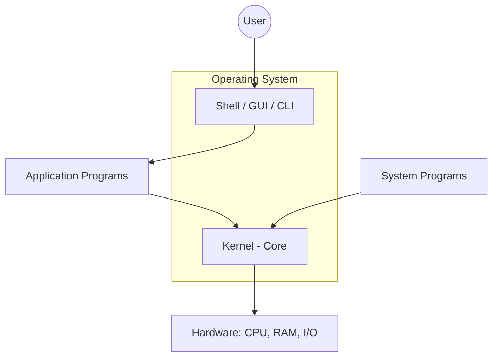
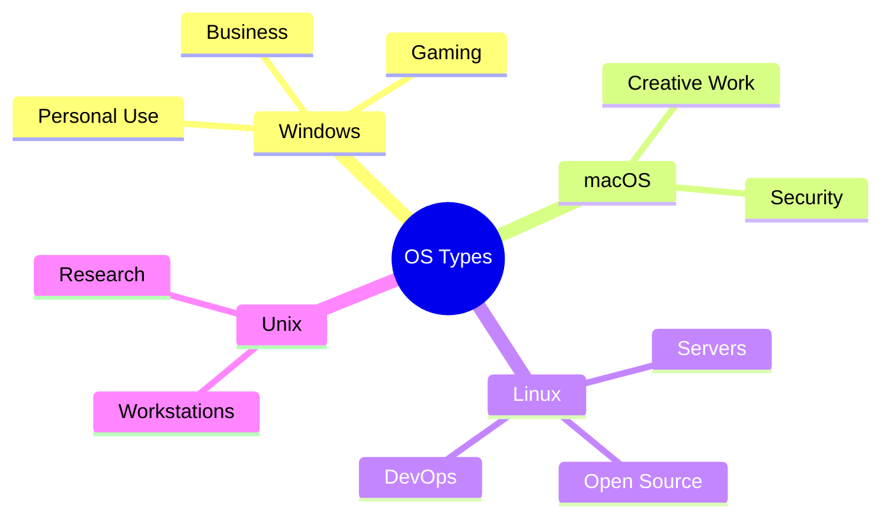

# Introduction to Operating System

An **Operating System (OS)** acts as an intermediary between the computer hardware and the user. It is the fundamental interface that allows users to interact with hardware components conveniently and efficiently.

---

## 🖥️ What is an Operating System?

The OS is a primary program that runs at all times on a computer. All other software, including application programs (like browsers or Word), run on top of the operating system.

### Core Responsibilities:
- **Resource Allocation**: Assigns CPU time, memory, and I/O devices to processes.
- **Fairness & Security**: Ensures that resource distribution is equitable and protected from unauthorized access.
- **Environment Provider**: Creates a stable environment where users can execute programs without worrying about low-level hardware complexities.

---

## 🏗️ System Hierarchy and User Interaction

Every general-purpose computer system is composed of four main elements working in harmony:

1. **Hardware**: The physical components like CPU, ALU, RAM, I/O devices, and storage.
2. **Operating System**: Manages and coordinates hardware resources among various system and application programs.
3. **System Programs**: Compilers, loaders, editors, and the OS utilities.
4. **Application Programs**: User-level software designed for specific tasks (e.g., Database systems, Video Players).

### Interaction Layers
The OS provides an interface for user interaction through two primary methods:
- **CLI (Command-Line Interface)**: Text-based interaction (e.g., Bash, PowerShell).
- **GUI (Graphical User Interface)**: Visual-based interaction with icons and windows (e.g., Windows Desktop, macOS Finder).

> **The Kernel**: At the very heart of the OS lies the Kernel. It is the primary interface between hardware and software, handling critical low-level operations like process management, memory control, and device drivers.

---

## 🎯 Goals of an Operating System

An OS strives to achieve both efficiency for the machine and convenience for the user.

### Primary Goals
| Goal | Description |
| :--- | :--- |
| **User Convenience** | Providing a user-friendly interface and making the system easy to use. |
| **Program Execution** | Providing the necessary environment and services for user programs to run smoothly. |
| **Resource Management** | Ensuring fair allocation of CPU, memory, and storage across all active tasks. |
| **Security** | Protecting system and user data from unauthorized access, ensuring confidentiality. |

### Secondary Goals
- **Efficient Resource Utilization**: Maximizing the performance of hardware resources.
- **Reliability & Robustness**: Handling errors gracefully and maintaining system stability.
- **Modularity**: Being easy to debug and update without affecting the entire system.

---

## 🧩 Components of an Operating System

The OS is broadly divided into two main layers:

- **🐚 Shell**: The outermost layer that handles user interaction. It interprets user commands and presents output from the system.
- **🧠 Kernel**: The core component that communicates directly with the hardware. It is responsible for the most critical tasks of the OS.

---

## 🌍 Common Operating Systems

There are various types of operating systems tailored for different needs:

- **Windows OS**: Developed by Microsoft. Dominant in personal computing, business environments, and gaming.
- **macOS**: Developed by Apple. Preferred for creative work (design, video editing) and premium user experiences.
- **Linux**: Open-source and community-maintained. Highly flexible, used in servers, data centers, and development.
- **Unix**: The foundation for many modern systems. Used in research, academia, and high-end workstations.

---

## 🚀 Key Applications

1. **Platform for Application Programs**: It provides a platform, on top of which, other programs, called application programs can run.
2. **I/O Management**: Controls and coordinates monitors, keyboards, printers, and other peripherals.
3. **Multitasking & Concurrency**: Manages memory segments so multiple programs can run simultaneously.
4. **Memory & File Control**: Handles the allocation and deallocation of RAM and manages file storage structures.
5. **System Security**: Implements authorization processes to keep user data and applications safe.

---

## ⌨️ How Users Interact with OS
Users don't usually "see" the OS working. Interaction happens through:
1. **Application Level**: Using GUI (e.g., Ctrl+P for printing).
2. **Shell / Terminal**: Using commands (Command Prompt in Windows, Terminal in Linux).

### System Calls
The OS performs every task using **System Calls**.
- **open()**: To open a file.
- **read() / write()**: To access data.
- **fork()**: To create a new process.
- **print()**: Invokes a hardware system call for the printer.

## ⚖️ Choosing the Right OS

When selecting an operating system, several critical factors come into play:

- **💰 Price**: Some are free (Linux), while others are paid (Windows, macOS).
- **♿ Accessibility**: OSs like macOS/iOS are known for simplicity, whereas Linux offers more power at the cost of complexity.
- **🔌 Compatibility**: Ensure the OS supports the specific professional software you require.
- **🛡️ Security**: While all modern OSs focus on security, macOS and Linux are often cited for their robust security architectures.
---
### 📚 References
- *Gate Smashers* - [Introduction to Operating System](https://www.youtube.com/watch?v=WJ-UaAaumNA&list=PLc5rXIqickU2_VgSS5fwa0Di4V7vsaOlr&index=2)
- *GeeksforGeeks* - [Operating System Basics](https://www.geeksforgeeks.org/operating-systems/)
