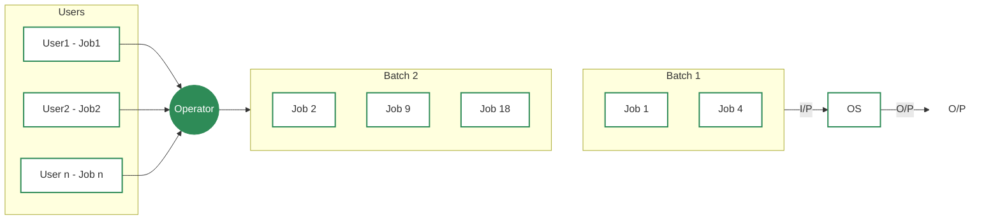
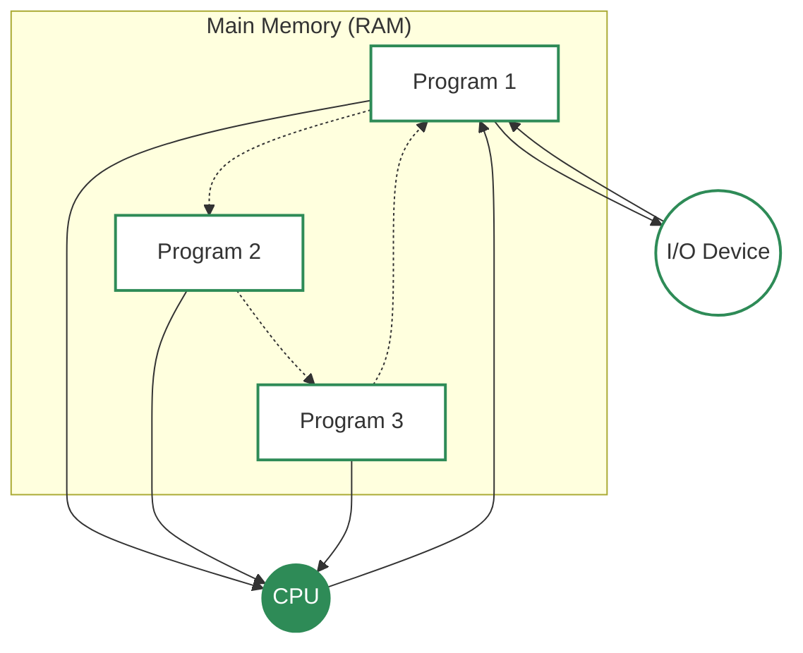
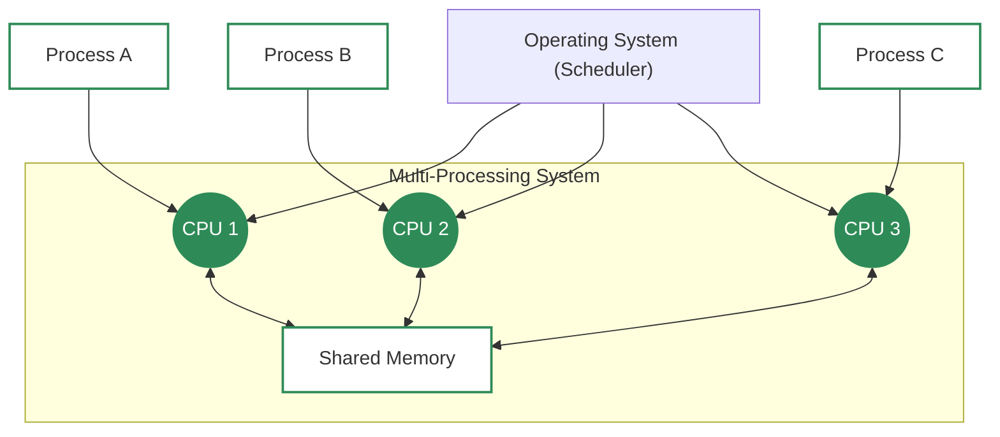
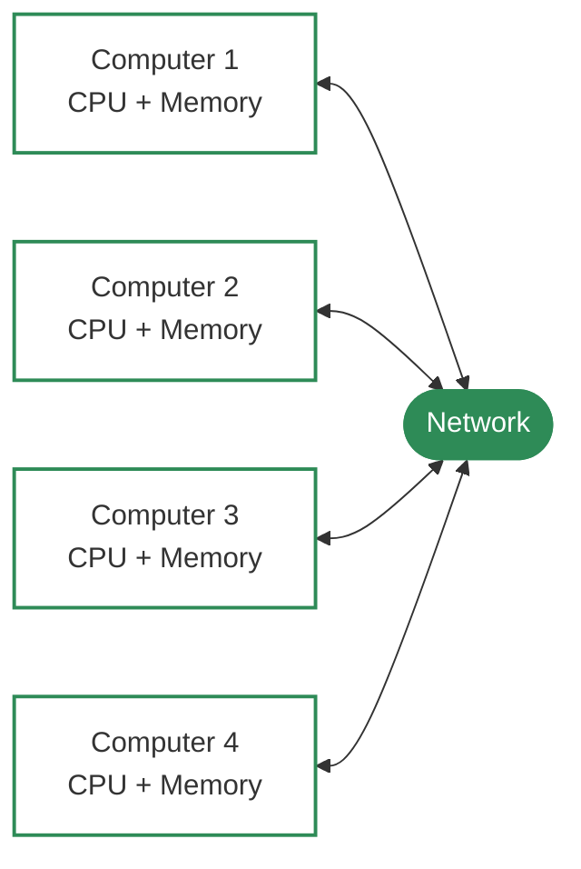
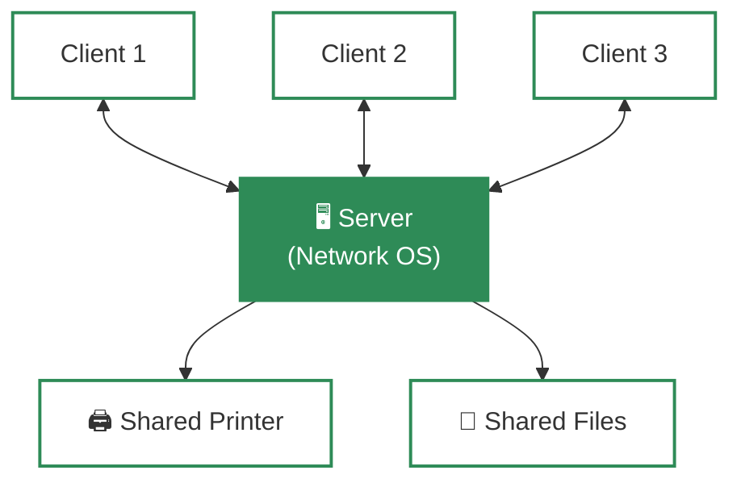
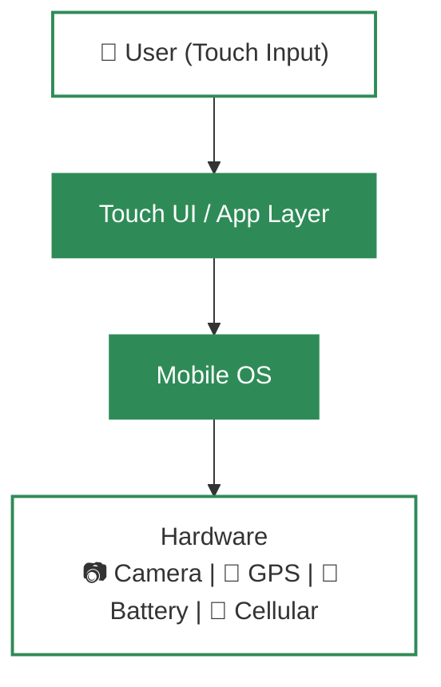

# Types of Operating System
- An operating system (OS) is software that manages computer hardware and software resources. It acts as a bridge between users and the computer, ensuring smooth operation. Different types of OS serve different needs; some handle one task at a time, while others manage multiple users or real-time processes.

### 📋 List of Operating Systems
1.  **Batch Operating System**
2.  **Multi-Programming Operating System**
3.  **Multi-Tasking / Time-Sharing Operating System**
4.  **Multi-Processing Operating System**
5.  **Distributed Operating System**
6.  **Network Operating System**
7.  **Real-Time Operating System**
8.  **Mobile Operating System**
---
## 1. Batch Operating System

**Definition**: A Batch Operating System is a type of operating system that executes groups of jobs (called batches) automatically, without direct user interaction during execution. Instead of running one program at a time with user input, similar tasks are collected, grouped, and processed together.

### 🟢 What is a Batch OS?
The batch-processing operating system was very popular in the 1970s. In batch operating system the jobs were performed in batches. This means Jobs having similar requirements are grouped and executed as a group to speed up processing. Users using batch operating systems do not interact with the computer directly. Each user prepares their job using an offline device for example a punch card and submits it to the computer operator. Once the programmers have left their programs with the operator, they sort the programs with similar needs into batches.

### ⚙️ How it Works
1.  **Job Submission**: Users prepare their jobs and hand them to an operator.
2.  **Batching**: The operator groups jobs with similar requirements into a **"Batch"**.
3.  **Execution**: The computer processes the whole batch sequentially (one after another) without stopping.

### ✨ Key Features
*   **No Interaction**: Users cannot control the program while it is running.
*   **Offline Processing**: Jobs are prepared away from the main computer.
*   **Efficiency**: Grouping similar jobs speeds up processing by reducing setup time.
*   **Ideal for**: Large volumes of data where no user input is needed (e.g., generating monthly bills).

### 🏛️ Examples
*   **Payroll Systems** (calculating salaries for thousands of employees).
*   **Bank Statements**.
*   **IBM's z/OS**.

### ✅ Advantages of Batch OS
*   **Resource Efficiency**: Keeps the CPU busy by reducing idle time between jobs.
*   **High Speed**: Can process large numbers of jobs quickly (High Throughput).
*   **Less User Error**: Since the computer handles execution, there are fewer chances of manual mistakes.
*   **Cost Effective**: Ideal for organizations performing repetitive, bulk tasks (like billing).

### ❌ Disadvantages of Batch OS
*   **No Direct Interaction**: Users cannot provide input or correct errors once the job starts.
*   **Hard to Debug**: If a job fails, it can be difficult to find the error immediately.
*   **Long Wait Time**: Users must wait for the entire batch to process before seeing results.
*   **Starvation**: If a job enters an infinite loop, other jobs in the batch must wait.

### 📝 Conclusion
Batch Operating Systems are great for **bulk, repetitive tasks** where speed matters and user interaction isn't needed, but they lack the flexibility and responsiveness of modern systems.

---

## 2. Multi-Programming Operating System

**Definition**: Multi-Programming is a technique where the operating system keeps multiple programs (or processes) in memory at the same time. When one program has to wait (e.g., for input/output), the CPU switches to another program, ensuring the CPU is always busy.

### 🟢 What is a Multi-Programming OS?
As the name suggests, Multiprogramming means more than one program can be active at the same time. Before the operating system concept, only one program was to be loaded at a time and run. These systems were not efficient as the CPU was not used efficiently.

Example: In a single-tasking system, the CPU is not used if the current program waits for some input/output to finish. The idea of multiprogramming is to assign CPUs to other processes while the current process might not be finished. This has the below advantages:
   - The user gets the feeling that he/she can run multiple applications on a single CPU even if the CPU is running one process at a time.
   - CPU is utilized better.

### ⚙️ How it Works
1.  **Load Multiple Programs**: The OS loads several programs into the main memory (RAM).
2.  **CPU Scheduling**: The CPU executes instructions from one program.
3.  **Switching**: If the current program needs to wait (e.g., for data from a hard drive), the OS **switches** the CPU to another program that is ready to run.
4.  **Return**: Once the waiting task is done, it can be brought back into memory.

### ✨ Key Features
*   **High CPU Utilization**: The CPU rarely stays idle.
*   **Better Throughput**: More jobs are completed in the same amount of time compared to batch systems.
*   **Memory Management**: Requires sophisticated memory management to keep track of multiple programs.
*   **No Interaction**: Like batch systems, users generally do not interact with the programs while they are running.

### 🏛️ Examples
*   **Early mainframe systems** (like IBM System/360).
*   **Modern batch processing systems** that require some level of multitasking.

---

### Multi-Programming Diagram

### ✅ Advantages of Multi-Programming
*   **Better CPU Utilization**:  CPU stays busy by switching to another job during I/O wait.
*   **Better Response**: Users get faster turnaround times as their jobs are processed sooner.
*   **Resource Sharing**: Memory and I/O devices are shared among multiple programs.
*   **Higher Throughput**: More jobs can be completed in a given time.

### ❌ Disadvantages of Multi-Programming
*   **Complex Memory Management**: Requires sophisticated techniques to manage memory for multiple programs.
*   **Deadlock Risk**: Programs might wait for each other indefinitely (deadlock).
*   **Security Issues**: One program might accidentally access or corrupt another program's data.
*   **No Direct Interaction**: Users still cannot interact with their programs during execution.
*   **High Memory Requirement**: Needs larger RAM to run multiple programs together..

### 📝 Conclusion
Multi-Programming was a significant improvement over batch systems, allowing for **better resource utilization** and **faster processing**. It laid the groundwork for modern multitasking operating systems.

---

## 3. Multi-Tasking / Time-Sharing Operating System

**Definition**: A Multi-Tasking (or Time-Sharing) OS is a type of multiprogramming system where every process gets a fixed, small slice of CPU time called a **quantum**. After the quantum expires, the OS moves on to the next task — cycling through all tasks in a round-robin manner so everything appears to run simultaneously.

### 🟢 What is a Multi-Tasking OS?
The key idea is **fairness** — every task gets a turn, no matter how many users or programs are active. Whether it's one user running many apps or many users on the same machine, each gets a small, equal share of CPU time so the system feels responsive to all of them.

### ⚙️ How it Works
1. **Load Tasks**: Multiple tasks are kept in memory simultaneously.
2. **Time Slice**: The CPU is assigned to one task for a short fixed duration (quantum).
3. **Switch**: When the quantum ends, the OS saves the task's state and moves to the next task.
4. **Repeat**: The cycle continues in a round-robin fashion until all tasks are complete.

```mermaid
gantt
    title CPU Time-Sharing (Round Robin)
    dateFormat X
    axisFormat %s

    section Task A
    Quantum 1 :0, 1
    Quantum 2 :3, 4

    section Task B
    Quantum 1 :1, 2
    Quantum 2 :4, 5

    section Task C
    Quantum 1 :2, 3
    Quantum 2 :5, 6
```

### ✨ Key Features
- **Round-Robin Scheduling**: Each task gets an equal, fair turn.
- **Context Switching**: OS saves and restores task state on every switch.
- **Illusion of Parallelism**: Tasks appear to run simultaneously, though only one runs at a time on a single CPU.
- **Supports Multiple Users**: Many users can work on the same machine at the same time.

### 🏛️ Examples
- IBM VM/CMS
- TSO (Time Sharing Option)
- Windows Terminal Services

### ✅ Advantages of Multi-Tasking OS
- **Equal CPU Access**: Each task gets a fair share of CPU time.
- **Reduced Software Duplication**: Many users can run the same software without needing separate copies.
- **Low CPU Idle Time**: Efficient scheduling keeps the CPU busy.

### ❌ Disadvantages of Multi-Tasking OS
- **Lower Reliability**: System failures affect all users at once.
- **Security Concerns**: Multiple users sharing a system increases risks to data privacy and integrity.
- **Communication Issues**: Data sharing between users can lead to conflicts or inconsistencies.

### 📝 Conclusion
Multi-Tasking OS made computers feel **interactive and responsive** for multiple users at once. It is the direct ancestor of the modern desktop OSs we use every day.

---

## 4. Multi-Processing Operating System

**Definition**: A Multi-Processing OS uses **two or more CPUs** (processors) within a single system to execute tasks simultaneously. This increases overall throughput and provides fault tolerance, since if one processor fails, others can continue working.

### 🟢 What is a Multi-Processing OS?
Unlike multi-tasking (which shares one CPU), multi-processing gives you actual hardware parallelism — multiple CPUs literally working at the same time. The OS distributes tasks across all available processors to get more done faster.

### ⚙️ How it Works
1. **Multiple CPUs** are connected and share the same memory and I/O devices.
2. The OS **distributes processes** across all processors.
3. Processors work **simultaneously** on different tasks.
4. If one processor fails, the OS **reassigns its work** to the remaining processors (fault tolerance).

### 🏛️ Examples
- UNIX
- Linux (Ubuntu, Red Hat, Debian)
- macOS

### ✅ Advantages of Multi-Processing OS
- **Faster Processing**: Multiple CPUs work simultaneously, increasing overall system speed.
- **High Reliability**: If one processor fails, others can continue working (fault tolerance).
- **Supports Heavy Tasks**: Ideal for computation-intensive tasks like scientific simulations or industrial applications.

### ❌ Disadvantages of Multi-Processing OS
- **High Cost**: Multiple processors and complex hardware significantly increase cost.
- **Complex Design**: The OS must handle inter-processor communication and task distribution.
- **Not Always Efficient**: Poor task distribution can result in idle processors and wasted resources.

### 📝 Conclusion
Multi-Processing OS is built for **power and reliability**. It's the backbone of servers, supercomputers, and any system where performance or uptime cannot be compromised.

---

## 5. Distributed Operating System

**Definition**: A Distributed OS connects **multiple independent computers** through a shared communication network, making them work together as a single unified system. Each machine has its own CPU and memory, but users can access resources (files, software) on any machine in the network.

### 🟢 What is a Distributed OS?
The key benefit is **resource sharing across machines**. A user on one computer can run a program or access a file stored on a completely different computer in the network — transparently, as if it were local.

### ⚙️ How it Works
1. **Independent Nodes**: Each computer (node) operates independently with its own CPU and memory.
2. **Network Communication**: Nodes communicate via a shared network to coordinate tasks.
3. **Transparent Access**: The OS hides the complexity — users don't need to know which machine holds the resource.
4. **Task Distribution**: The OS can split a large computation across multiple machines for speed.

### 🏛️ Examples
- LOCUS
- MICROS
- Amoeba

### ✅ Advantages of Distributed OS
- **Independent Systems**: Failure of one machine does not affect others.
- **Easily Scalable**: New machines can be added to the network with minimal disruption.
- **Lower Processing Delays**: Tasks are distributed across machines for faster completion.

### ❌ Disadvantages of Distributed OS
- **Network Dependency**: If the main network fails, communication between nodes stops entirely.
- **Lack of Standardization**: No universally accepted language or model exists for building distributed systems.
- **High Cost & Complexity**: Hardware is expensive and the software is complex and difficult to maintain.
- **Security Risk**: Messages travel over public networks and can be intercepted or tampered with.
- **Data Inconsistency**: Network delays can make it difficult to maintain a consistent view of shared data.

### 📝 Conclusion
Distributed OS is the foundation of **cloud computing and modern large-scale systems**. It trades simplicity for massive scalability and resilience.

---

## 6. Network Operating System

**Definition**: A Network Operating System (NOS) runs on a **central server** and manages shared resources like files, printers, applications, users, and security for all computers connected to a private network.

### 🟢 What is a Network OS?
Unlike a Distributed OS where all machines appear as one system, in a NOS the **server and clients are clearly distinct**. Users know they are accessing a remote server. The server controls everything centrally, which is why NOS is called a **tightly coupled system**.

### ⚙️ How it Works
1. A powerful **server** runs the NOS and hosts shared resources.
2. **Client computers** connect to the server over a local network.
3. Users log in and access shared files, printers, or applications **from the server**.
4. The NOS handles **authentication, permissions, and resource management** centrally.

### 🏛️ Examples
- Microsoft Windows Server 2003
- UNIX, Linux
- Mac OS X

### ✅ Advantages of Network OS
- **Centralized & Stable Servers**: Reliable management of all shared resources from one place.
- **Easy Upgrades**: New hardware or software can be added to the server without disrupting clients.
- **Remote Access**: Users can access the server from different locations and devices.

### ❌ Disadvantages of Network OS
- **High Server Cost**: Setting up and maintaining dedicated servers is expensive.
- **Dependency on Server**: If the server goes down, all users lose access to shared resources.
- **Regular Maintenance Needed**: Requires frequent updates and technical support to stay secure and running.

### 📝 Conclusion
Network OS is ideal for **offices, schools, and organizations** that need centralized control over shared resources — the backbone of corporate IT infrastructure.

---

## 7. Real-Time Operating System

**Definition**: A Real-Time Operating System (RTOS) is designed for systems where **timing is critical**. It processes inputs and produces responses within a guaranteed, very short time interval called **response time**. Used in systems where a delayed response is as bad as — or worse than — no response.

### 🟢 What is a Real-Time OS?
RTOS is used wherever lives or critical processes depend on immediate responses — missile guidance systems, aircraft autopilot, pacemakers, robots, and factory automation. The OS must be **deterministic** (predictable timing) above all else.

### Types of Real-Time OS

| Type | Timing Requirement | Consequence of Missing Deadline | Examples |
| :--- | :--- | :--- | :--- |
| **Hard RTOS** | Absolute — no delay acceptable | Catastrophic (system failure, injury) | Airbags, automatic parachutes, pacemakers |
| **Soft RTOS** | Preferred — minor delays tolerable | Degraded quality but not catastrophic | Video streaming, gaming, multimedia |

> **Hard RTOS** avoids virtual memory entirely to ensure immediate, predictable response times. Nothing can delay a hardware interrupt.

### ⚙️ How it Works
1. **Event or input** arrives (e.g., sensor signal, interrupt).
2. The OS **immediately preempts** any lower-priority task.
3. The correct task is **scheduled and executed** within the response time deadline.
4. **Result is produced** — control signal, output, or action — before the deadline expires.

### 🏛️ Examples
- Scientific experiments
- Medical imaging systems
- Robots and industrial automation

### ✅ Advantages of Real-Time OS
- **Maximum Resource Utilization**: Hardware is used at peak efficiency.
- **Error-Free Operation**: Deterministic scheduling minimizes the chance of errors.
- **Predictable Memory Allocation**: Memory is managed with strict control to guarantee timing.

### ❌ Disadvantages of Real-Time OS
- **Limited Tasks**: Can only run a very small number of tasks simultaneously to maintain timing guarantees.
- **Complex Algorithms**: Scheduling algorithms are highly complex to design and implement correctly.
- **Poor Task Switching**: Setting thread priorities is tricky — unnecessary switching can break real-time guarantees.

### 📝 Conclusion
Real-Time OS is built for **precision, not convenience**. Wherever a missed deadline has real-world consequences — safety, accuracy, or control — RTOS is the only option.

---

## 8. Mobile Operating System

**Definition**: A Mobile Operating System is designed specifically for **smartphones and tablets**. It manages the device's hardware (touchscreen, camera, GPS, battery) and software (apps), providing a seamless, touch-first user experience.

### 🟢 What is a Mobile OS?
Mobile OS is an evolution of traditional desktop OS, optimized for:
- **Touch input** instead of keyboard/mouse.
- **Battery efficiency** — every operation must be power-aware.
- **Connectivity** — Wi-Fi, Bluetooth, cellular networks, GPS.
- **App ecosystems** — app stores with millions of apps.

### ⚙️ How it Works
1. The OS **boots** and initializes hardware (screen, sensors, radio).
2. **App processes** run in sandboxed environments so they can't interfere with each other.
3. The OS **manages battery** by suspending background apps when not needed.
4. **Connectivity stack** handles switching between Wi-Fi, cellular, and Bluetooth seamlessly.
5. **App store** provides a curated and secure way to install software.

### 🏛️ Examples
- **Android** (Google) — open-source, largest market share, used on many device brands.
- **iOS** (Apple) — closed ecosystem, used exclusively on iPhones and iPads.
- **BlackBerry OS** — historically significant for enterprise and security.

### ✅ Advantages of Mobile OS
- **User-Friendly Interfaces**: Designed to be intuitive and accessible to all types of users.
- **Extensive App Ecosystems**: Millions of apps available for customization and productivity.
- **Connectivity Options**: Seamless support for Wi-Fi, Bluetooth, cellular, GPS, and NFC.

### ❌ Disadvantages of Mobile OS
- **Battery Life Constraints**: Heavy usage drains batteries quickly despite power management improvements.
- **Security Risks**: Mobile devices are frequent targets for malware, phishing, and privacy attacks.
- **Fragmentation (Android)**: Wide variety of devices and custom Android versions makes it hard for developers to ensure compatibility across all devices.

### 📝 Conclusion
Mobile OS powers billions of devices and has fundamentally changed how humans interact with computers — from a desk-bound tool to an always-connected companion in our pockets.

---
