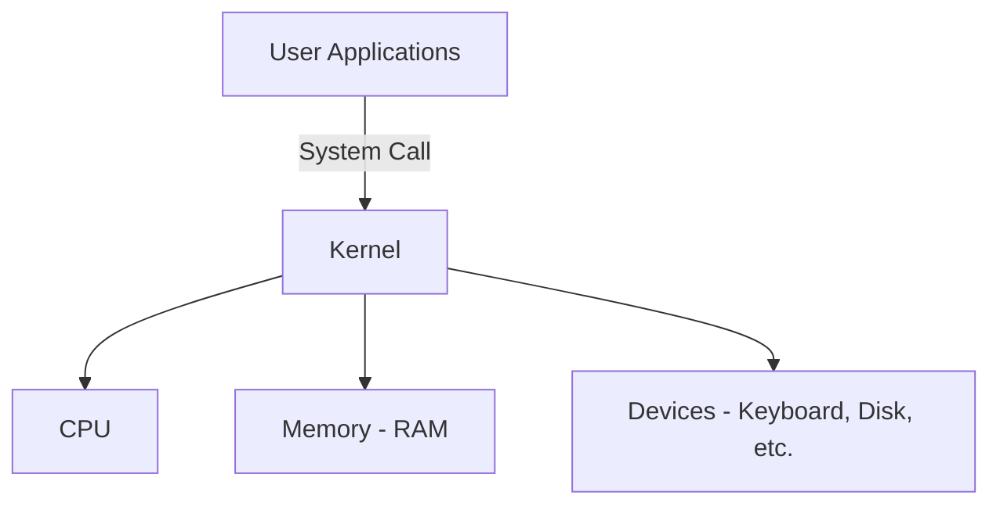
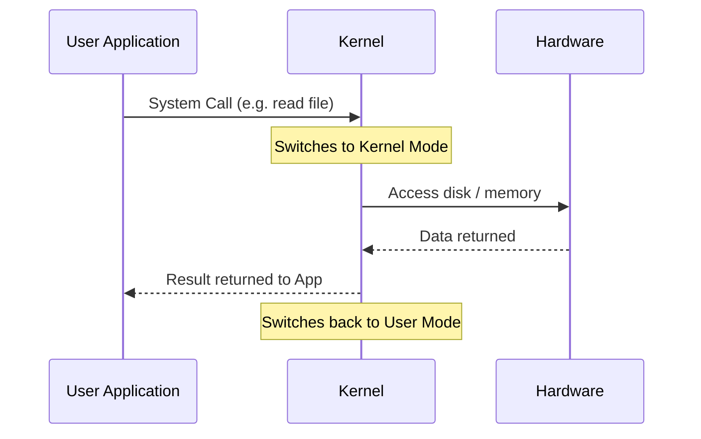

# Kernel in Operating System

The **kernel** is the  heart of an Operating System. While the OS is everything you see and interact with, the kernel is the invisible engine running underneath — constantly managing your hardware so your programs can run smoothly.

> Think of the OS as a restaurant: the **user interface** is the dining room, and the **kernel** is the kitchen — hidden but responsible for everything that actually gets done.

---

## 🧠 What is a Kernel?

The kernel is the **core component** of an OS that sits directly between your software applications and the physical hardware (CPU, RAM, devices).

- It loads into memory **first** when your computer boots up.
- It **stays in memory** the entire time your system is running.
- It has special privileges — it runs in **kernel mode**, meaning it can directly access and control hardware. Normal apps run in **user mode** and cannot.



---

## 🔄 How Does the Kernel Work?

Here's the step-by-step flow of what happens when you do something like open a file:

1. **You click "Open"** → your app sends a request called a **system call**.
2. The CPU **switches from user mode → kernel mode** so the kernel can take control safely.
3. The kernel **finds the file**, reads it from disk into memory.
4. The kernel **returns the data** back to your app and switches back to user mode.
5. Repeat — the kernel **context switches** between many programs to keep everything running simultaneously (multitasking).



---

## ⚙️ Functions of the Kernel

| Function | What It Does |
| :--- | :--- |
| **Process Management** | Decides which program runs, when, and for how long (scheduling). |
| **Memory Management** | Allocates RAM to programs, manages virtual memory, prevents programs from interfering with each other. |
| **Device Management** | Acts as a translator between your programs and hardware devices (keyboard, mouse, printer, disk). |
| **File System Management** | Handles reading, writing, creating, and deleting files on disk. |
| **Resource Management** | Distributes CPU time, disk space, and network bandwidth fairly among running programs. |
| **Security & Access Control** | Enforces permissions — who can read/write which files, which apps can do what. |
| **Inter-Process Communication (IPC)** | Allows different running programs to talk to each other safely (via shared memory or message passing). |

---

## 🏗️ Types of Kernels

Different kernel designs make different trade-offs between **speed** and **safety/reliability**.

### 1. Monolithic Kernel
- **All OS services run inside the kernel** in one big block.
- Very **fast** because everything is in one place with no extra communication overhead.
- But if one part crashes, it can bring down the whole system.
- **Examples**: Linux, Unix, OpenVMS

```
[ Kernel Space ]
 Process Mgmt | Memory Mgmt | File System | Drivers | ...all together
```

### 2. Microkernel
- Only the **bare minimum** lives in the kernel (memory, scheduling, IPC).
- Everything else (file systems, drivers) runs in **user space** as separate services.
- More **reliable** — a crashed driver won't take down the whole OS.
- But slower due to extra communication between services.
- **Examples**: Minix 3, Mach 3.0

```
[ Kernel Space ]  →  just: scheduling + memory + basic IPC
[ User Space ]    →  file system, drivers, network stack (as separate processes)
```

### 3. Hybrid Kernel
- A **mix** of monolithic and microkernel.
- Performance-critical parts stay in kernel space; others are isolated for safety.
- The most common design in modern consumer OS.
- **Examples**: Windows (NT family: XP, 7, 10, 11), macOS (XNU)

### 4. Nanokernel
- Even more minimal than a microkernel — provides only the tiniest hardware abstraction.
- Everything else is pushed outside.
- **Examples**: Nemesis, MIT Exokernel (XOK, Aegis)

### 5. Exokernel
- Focuses on **protection** rather than managing abstractions.
- Gives applications **direct control** over hardware resources so they can build their own abstractions.
- Mostly an experimental/research concept.

---

## 🆚 Kernel vs. Operating System

| | Kernel | Operating System |
| :--- | :--- | :--- |
| **What it is** | Core part of the OS | Complete software suite |
| **Includes** | Process, memory, device management | Kernel + UI + file system + apps + utilities |
| **User interaction** | None (works behind the scenes) | Yes (GUI, CLI, settings) |
| **Size** | Small and focused | Large and feature-rich |

> The kernel is **part of** the OS — every OS has one, but they are not the same thing.

---

## 🛡️ Kernel Mode vs. User Mode

This is a key security concept built into modern CPUs:

| | Kernel Mode | User Mode |
| :--- | :--- | :--- |
| **Who runs here** | The kernel | Your applications |
| **Hardware access** | Direct — can do anything | None — must ask the kernel |
| **Risk if something crashes** | Can crash the whole system | Only that app crashes |
| **How to request kernel** | Already there | Via **system calls** |

This separation is what keeps a buggy or malicious app from destroying your system.

---

## 🔑 Key Takeaways

- The kernel is the **core** of every OS — it bridges software and hardware.
- It runs in a **privileged mode** that normal apps can't access.
- Apps communicate with the kernel through **system calls**.
- There are different kernel **types** (monolithic, micro, hybrid) — each with different speed vs. reliability trade-offs.
- **Linux** uses a monolithic kernel; **Windows** and **macOS** use hybrid kernels.

---

### 📚 References
- *GeeksforGeeks* - [Kernel in Operating System](https://www.geeksforgeeks.org/kernel-in-operating-system/)
- *Gate Smashers* - [Kernel & Types of Kernel](https://www.youtube.com/watch?v=WJ-UaAaumNA)
