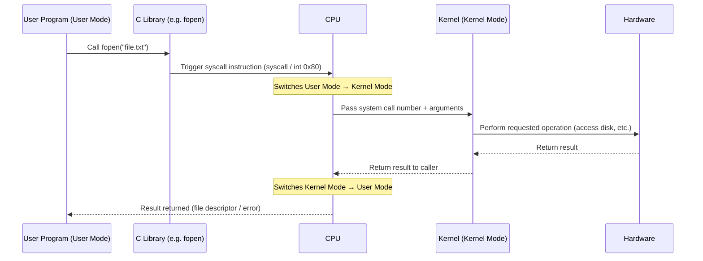
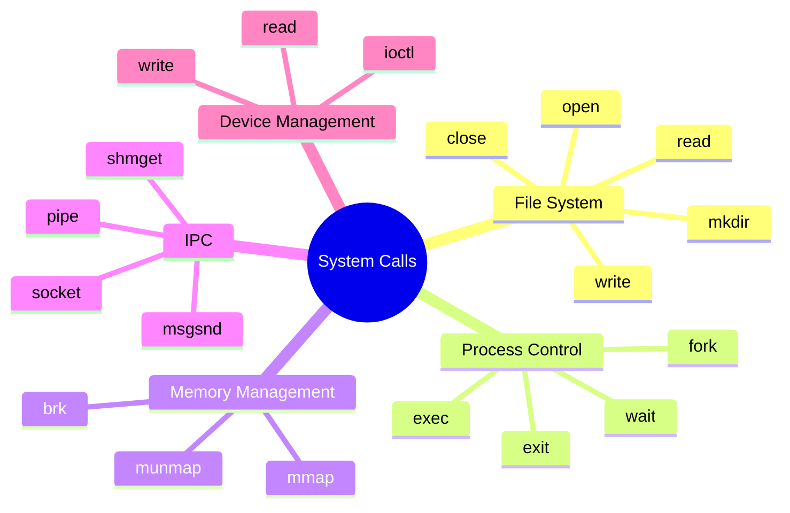
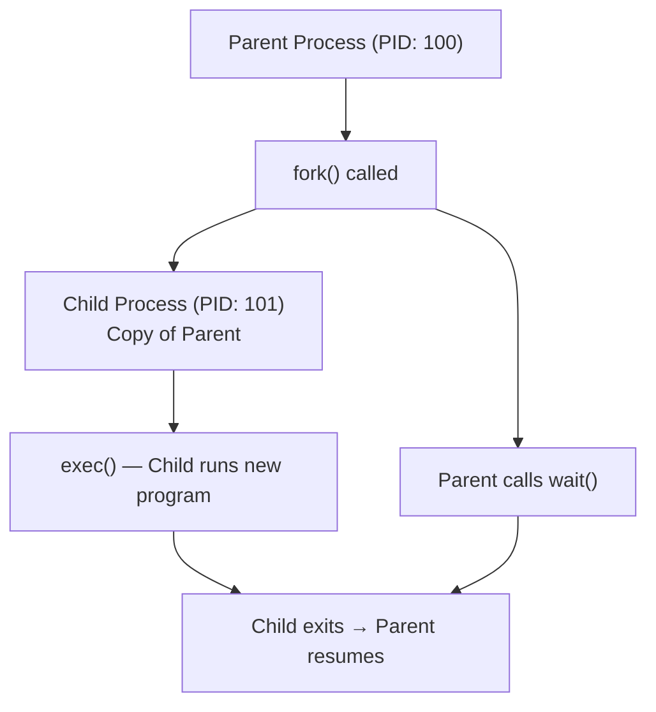
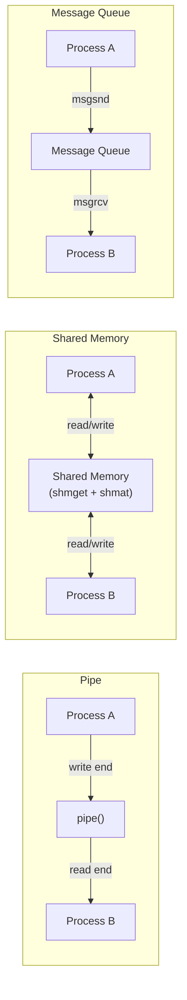
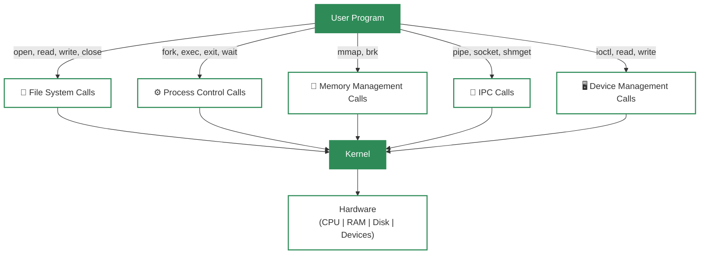

# System Calls in Operating System

User programs cannot directly touch the hardware or critical OS resources — doing so would make the system **unstable and insecure**. So the OS provides a safe, controlled mechanism called **system calls** that let programs request services from the kernel without ever touching hardware directly.

> Think of a system call like a **restaurant order** — you (the program) never walk into the kitchen (kernel/hardware). You give your order (system call) to the waiter (OS interface), who handles everything safely and brings back the result.

---

## 🔑 What is a System Call?

A **system call** is a programmatic way for a user-space application to request a service from the operating system's kernel.

- The **only** legitimate entry point into the kernel from user programs.
- Executed in **kernel mode** (privileged), not user mode.
- Acts as the **bridge** between user programs and hardware.

### Common Real-World Examples

| Action You See | System Call Being Used |
| :--- | :--- |
| Opening a file (`fopen()` in C) | `open()` |
| Reading from a file | `read()` |
| Writing text to the screen | `write()` |
| Running a new program in Linux | `fork()` + `exec()` |
| Closing a file | `close()` |
| Allocating memory (`malloc()` in C) | `brk()` / `mmap()` |

> The C library functions you use (like `fopen`, `printf`, `malloc`) are **wrappers** — they internally make the actual system calls for you.

---

## ⚙️ How Does a System Call Work?

Here is the step-by-step journey of a system call from start to finish:



### Step-by-Step Breakdown

1. **User program** calls a library function (e.g. `fopen()`).
2. The library prepares arguments and triggers a **syscall instruction** (`syscall` on x86-64 or `int 0x80` on older x86).
3. The **CPU switches from user mode → kernel mode** — this is called a **mode switch**.
4. The kernel reads the **system call number** to know what was requested.
5. The kernel **performs the operation** (file I/O, memory allocation, process creation, etc.).
6. The kernel **switches back to user mode** and returns the result (or an error code) to the program.

### ⚠️ Mode Switch vs Context Switch — Don't Confuse These!

| | Mode Switch | Context Switch |
| :--- | :--- | :--- |
| **What changes** | CPU privilege level (user ↔ kernel) | Which process is running |
| **When it happens** | On every system call | Only when the calling process is **blocked** |
| **Cost** | Lightweight | Heavier — saves/restores full process state |

> Every system call causes a **mode switch**, but NOT every system call causes a **context switch**.

---

## 🗂️ Types of System Calls

System calls are grouped by the kind of service they provide. There are **5 main categories**:



---

### 1. 📁 File System System Calls

Used to create, open, read, write, and manage files and directories.

| System Call | What It Does |
| :--- | :--- |
| `open(path, flags)` | Opens a file; returns a file descriptor |
| `read(fd, buf, n)` | Reads `n` bytes from a file into a buffer |
| `write(fd, buf, n)` | Writes `n` bytes from a buffer to a file |
| `close(fd)` | Closes an open file descriptor |
| `mkdir(path)` | Creates a new directory |
| `unlink(path)` | Deletes a file |
| `stat(path, buf)` | Gets file metadata (size, permissions, timestamps) |

**Example — Reading a file in C:**
```c
int fd = open("notes.txt", O_RDONLY);   // system call: open()
char buf[100];
read(fd, buf, 100);                      // system call: read()
close(fd);                               // system call: close()
```

---

### 2. ⚙️ Process Control System Calls

Used to create, execute, synchronize, and terminate processes.

| System Call | What It Does |
| :--- | :--- |
| `fork()` | Creates a new child process (exact copy of parent) |
| `exec()` | Replaces the current process image with a new program |
| `exit(status)` | Terminates the current process |
| `wait(pid)` | Parent waits for a child process to finish |
| `getpid()` | Returns the process ID of the calling process |
| `kill(pid, signal)` | Sends a signal to a process (e.g., terminate it) |

**Example — Creating a process in Linux:**
```c
pid_t pid = fork();       // system call: fork()
if (pid == 0) {
    exec("/bin/ls", ...); // system call: exec() — child runs a new program
} else {
    wait(NULL);           // system call: wait() — parent waits for child
}
```



---

### 3. 🧠 Memory Management System Calls

Used to allocate, deallocate, and manage memory for processes.

| System Call | What It Does |
| :--- | :--- |
| `brk(addr)` | Moves the end of the heap (grow/shrink memory) |
| `mmap(addr, len, ...)` | Maps files or devices into memory; also used for large allocations |
| `munmap(addr, len)` | Unmaps a previously mapped memory region |
| `mprotect(addr, len, prot)` | Changes memory region permissions (read/write/execute) |

> **Note:** When you call `malloc()` in C, it internally uses `brk()` or `mmap()` system calls — you never call these directly in normal code.

**Memory layout of a process:**
```
High Address ┌──────────────────┐
             │     Stack        │  ← grows downward
             │        ↓        │
             │   (free space)  │
             │        ↑        │
             │     Heap         │  ← grows upward via brk() / mmap()
             │  BSS Segment    │  (uninitialized globals)
             │  Data Segment   │  (initialized globals)
Low Address  │  Text Segment   │  (program code)
             └──────────────────┘
```

---

### 4. 🔗 Inter-Process Communication (IPC) System Calls

Used for data exchange and communication between different processes.

| System Call | What It Does |
| :--- | :--- |
| `pipe(fd[2])` | Creates a one-way communication channel between processes |
| `socket(domain, type, protocol)` | Creates a network socket for communication |
| `shmget(key, size, flags)` | Creates a shared memory segment |
| `shmat(shmid, ...)` | Attaches shared memory to the process's address space |
| `msgsnd(msqid, ...)` | Sends a message to a message queue |
| `msgrcv(msqid, ...)` | Receives a message from a message queue |

**Three main IPC mechanisms:**



---

### 5. 🖥️ Device Management System Calls

Used to request and release devices, and to perform read/write operations on them.

| System Call | What It Does |
| :--- | :--- |
| `open(device_path, ...)` | Opens a device file (e.g., `/dev/sda`, `/dev/tty`) |
| `read(fd, buf, n)` | Reads data from a device |
| `write(fd, buf, n)` | Writes data to a device |
| `ioctl(fd, request, ...)` | Sends a device-specific control command |
| `close(fd)` | Releases the device |

> In Linux/Unix, **everything is a file** — devices, sockets, pipes, and actual files all use the same `open/read/write/close` interface. This is one of Unix's most elegant design decisions.

---

## 🧩 Putting It All Together

Here's how all system call types connect to the bigger OS picture:



---

## 🆚 System Call vs Regular Function Call

| | Regular Function Call | System Call |
| :--- | :--- | :--- |
| **Who handles it** | User program itself | OS Kernel |
| **Mode switch** | No | Yes (user → kernel → user) |
| **Access to hardware** | No | Yes |
| **Speed** | Very fast | Slower (mode switch overhead) |
| **Example** | `strlen()`, `abs()` | `read()`, `fork()`, `open()` |

---

## 🔑 Key Takeaways

- System calls are the **only safe gateway** from user programs into the kernel.
- Every system call causes a **mode switch** (user → kernel) but not always a context switch.
- There are **5 categories**: File System, Process Control, Memory Management, IPC, and Device Management.
- C library functions like `fopen()` and `malloc()` are **wrappers** around system calls — you use them daily without realizing it.
- Without system calls, every program would need its own hardware access code — leading to **chaos and insecurity**.

---

### 📚 References
- *GeeksforGeeks* - [Introduction to System Call](https://www.geeksforgeeks.org/introduction-of-system-call/)
- *Gate Smashers* - [System Calls in OS](https://youtu.be/tWPa-rZiGM8?si=2OmQQlHsD6SDGXRI)
- *Linux Man Pages* - [syscalls(2)](https://man7.org/linux/man-pages/man2/syscalls.2.html)
