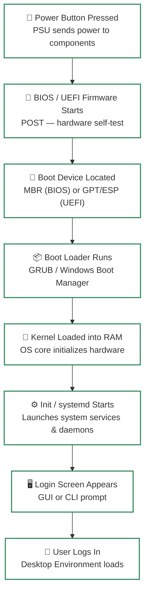
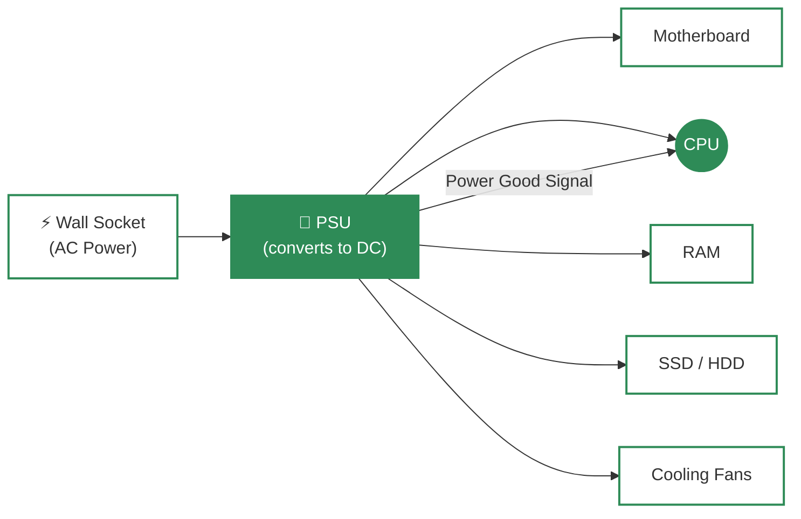
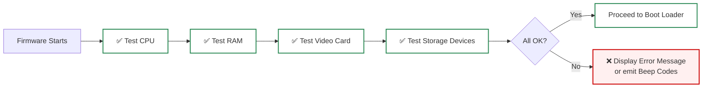
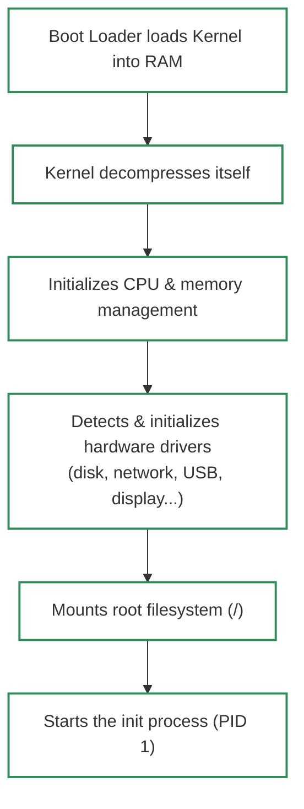
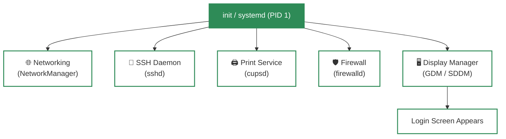
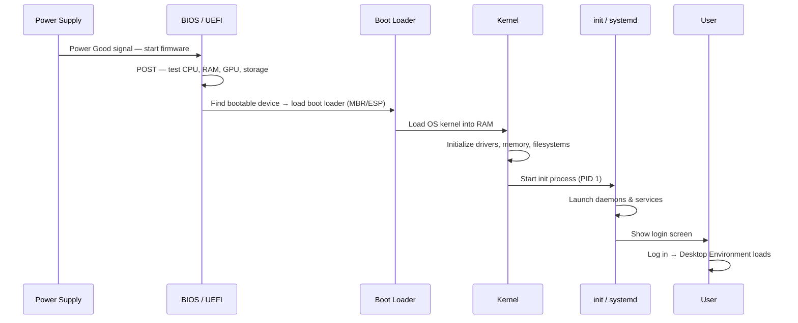
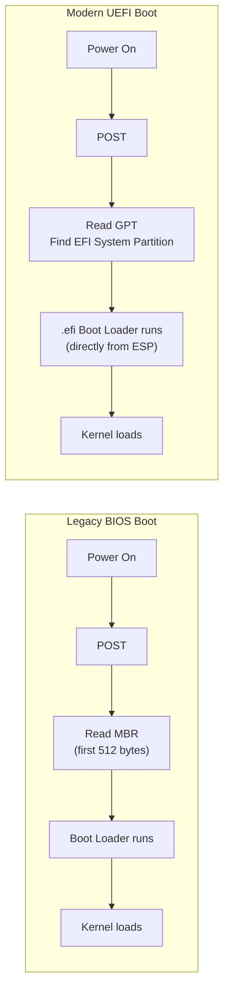

# What Happens When We Turn On a Computer?

A computer with no running program is just an expensive collection of electronic parts. The moment you press the power button, a precisely ordered chain of events — hardware checks, firmware initialization, boot loader execution, and OS startup — transforms that silent machine into a fully working system.

> The boot process is invisible to most users, but it is one of the most critical foundations of modern computing.

---

## 🗺️ Big Picture — The Boot Process at a Glance



---

## Step 1 — 🔌 Power Supply Initialization

When you press the power button, the **Power Supply Unit (PSU)** converts AC power from the wall into stable DC voltages and distributes electricity to every critical component:

| Component | Why It Needs Power First |
| :--- | :--- |
| **Motherboard** | The central hub — connects everything |
| **CPU (Processor)** | Needs to start executing the first instruction |
| **RAM** | Must be powered before any data can be stored |
| **Storage (HDD/SSD)** | Needed later to load the OS |
| **Cooling Fans / GPU** | Prevent overheating from the first second |

Once all components receive **stable voltage**, the PSU sends a special signal called **Power Good** to the motherboard, telling the CPU it is safe to start.



---

## Step 2 — 🔬 BIOS / UEFI Startup and POST

The CPU's very first instruction points to a **firmware chip** on the motherboard — either **BIOS** or its modern replacement **UEFI**.

### BIOS vs UEFI

| Feature | BIOS | UEFI |
| :--- | :--- | :--- |
| **Age** | Legacy (1970s–present) | Modern replacement for BIOS |
| **Interface** | Text-only | Graphical, mouse-supported |
| **Partition Table** | MBR (max 2 TB disks) | GPT (supports disks > 2 TB) |
| **Boot Speed** | Slower | Faster (parallel initialization) |
| **Security** | None built-in | Secure Boot support |
| **Drive Limit** | 4 primary partitions | 128 primary partitions |

### Power-On Self-Test (POST)

The firmware immediately runs **POST** — a hardware health check:



### POST Beep Codes (when no display is available)

| Beep Pattern | Common Meaning |
| :--- | :--- |
| 1 short beep | POST passed — system OK |
| 2 short beeps | POST error (varies by manufacturer) |
| Long continuous beep | RAM failure |
| Repeating short beeps | Power supply issue |
| 3 long beeps | Keyboard error |

> If POST fails, the boot process **stops here**. No OS is loaded.

### Other BIOS/UEFI Responsibilities

- **Hardware Initialization**: Configures all connected devices (USB, SATA, PCIe).
- **System Configuration**: Lets users set boot order, time/date, CPU settings.
- **Security**: Password protection, Secure Boot, TPM (Trusted Platform Module) support.

---

## Step 3 — 💾 Loading the Boot Loader (MBR & UEFI/GPT)

After POST succeeds, the firmware checks the configured **boot order** (e.g., SSD → USB → DVD) and looks for a bootable device.

### Legacy BIOS Path (MBR)

```
Disk Layout (MBR)
┌──────────────────────────────────────────────────────┐
│  Sector 0: Master Boot Record (MBR) — first 512 bytes │
│  ┌─────────────────┬──────────────┬───────────────┐   │
│  │  Boot Loader    │  Partition   │  Magic Number │   │
│  │  Code (446 B)   │  Table(64 B) │    (2 B)      │   │
│  └─────────────────┴──────────────┴───────────────┘   │
│  Sector 1+: Actual Partitions (C:, D:, /home, etc.)   │
└──────────────────────────────────────────────────────┘
```

1. BIOS reads the **first 512 bytes** of the boot disk — the MBR.
2. The MBR contains a tiny **boot loader program** and the **partition table**.
3. The boot loader is executed to find and load the OS.

### Modern UEFI Path (GPT)

```
Disk Layout (GPT + UEFI)
┌───────────────────────────────────────────────────┐
│  Protective MBR (for backward compatibility)       │
│  GPT Header                                        │
│  ┌─────────────────────────────────────────────┐   │
│  │  EFI System Partition (ESP) — FAT32 format  │   │
│  │  Contains: /EFI/Boot/bootx64.efi            │   │
│  │  (the actual boot loader executable)         │   │
│  └─────────────────────────────────────────────┘   │
│  Other Partitions (C:, /home, /data, etc.)         │
│  GPT Backup Header (at end of disk)                │
└───────────────────────────────────────────────────┘
```

1. UEFI reads the **GUID Partition Table (GPT)** and finds the **EFI System Partition (ESP)**.
2. It directly runs the **`.efi` boot loader file** stored there.

### Common Boot Loaders

| Boot Loader | OS | Role |
| :--- | :--- | :--- |
| **GRUB** (GRand Unified Bootloader) | Linux | Shows OS selection menu, loads kernel |
| **LILO** | Older Linux systems | Legacy Linux boot loader |
| **Windows Boot Manager** | Windows | Loads Windows kernel (`ntoskrnl.exe`) |
| **Bootcamp** | macOS (Intel) | Dual-boot macOS/Windows selector |

> The boot loader's **only job** is to find the OS kernel on disk and load it into RAM.

---

## Step 4 — 🧠 Kernel Loading and Initialization

Once the boot loader runs, it loads the **OS kernel** into RAM and hands over control.

### What the Kernel Does at Startup



### Run Levels (Traditional SysV init)

After the kernel starts, it launches the **init process** which decides the system's **run level** — what set of services to start:

| Run Level | Mode | Description |
| :--- | :--- | :--- |
| **0** | Halt | Shuts the system down |
| **1** | Single User | Maintenance mode — no network, one user |
| **2** | Multi-user | No networking (Debian/Ubuntu default base) |
| **3** | Multi-user + Network | Text-based login — servers typically use this |
| **4** | Unused | Custom / user-defined |
| **5** | Multi-user + GUI | Full graphical desktop (most desktop systems) |
| **6** | Reboot | Restarts the system |

> **Modern systems** (most Linux distros, macOS) use **systemd** or **upstart** instead of the old SysV init. systemd is faster because it starts services **in parallel** instead of one by one.

---

## Step 5 — ⚙️ Starting System Services and Daemons

The **init / systemd** process (always **PID 1** — the very first user-space process) reads its configuration and launches **daemons** — background services that keep running silently.

### Common Daemons Started at Boot

| Daemon | What It Does |
| :--- | :--- |
| **NetworkManager / dhcpcd** | Sets up wired/wireless network connections |
| **sshd** | Enables remote login via SSH |
| **cupsd** | Printing service |
| **firewalld / ufw** | Firewall / security rules |
| **X server / Wayland compositor** | Graphical display system |
| **Display Manager (GDM, SDDM, LightDM)** | Shows the graphical login screen |



---

## Step 6 — 🖥️ User Login and Desktop Environment

The final step — the user sees a **login screen** (GUI) or a **command-line prompt** (CLI).

1. User enters credentials → OS verifies identity.
2. The **Desktop Environment** (DE) loads:
   - **Windows**: Windows Explorer shell (taskbar, desktop).
   - **macOS**: Finder + Dock.
   - **Linux**: GNOME, KDE Plasma, XFCE, etc.
3. User programs and startup apps launch.
4. The computer is now **fully ready**.

---

## 🔄 Complete Boot Flow Summary



---

## ⚖️ BIOS Boot vs UEFI Boot — Side by Side



---

## 🔑 Key Takeaways

- The boot process has **6 clear stages**: Power → POST → Boot Loader → Kernel → Init/Daemons → Login.
- **POST** is the hardware health check — if it fails, the OS never loads.
- **BIOS uses MBR**; **UEFI uses GPT + EFI System Partition** — UEFI is faster, more secure, and supports larger disks.
- The **boot loader** (GRUB, Windows Boot Manager) is the bridge between firmware and the OS kernel.
- The **kernel** is the first OS code to run — it sets up everything the OS needs.
- **init / systemd** (PID 1) is the parent of all other processes — it starts all services.
- By the time you see the login screen, **hundreds of components and services** have already been initialized.

---

### 📚 References
- *GeeksforGeeks* - [What Happens When We Turn On a Computer?](https://www.geeksforgeeks.org/what-happens-when-we-turn-on-computer/)
- *OSDev Wiki* - [Boot Sequence](https://wiki.osdev.org/Boot_Sequence)
- *Linux From Scratch* - [System Initialization](https://www.linuxfromscratch.org/lfs/view/stable/chapter09/bootscripts.html)
