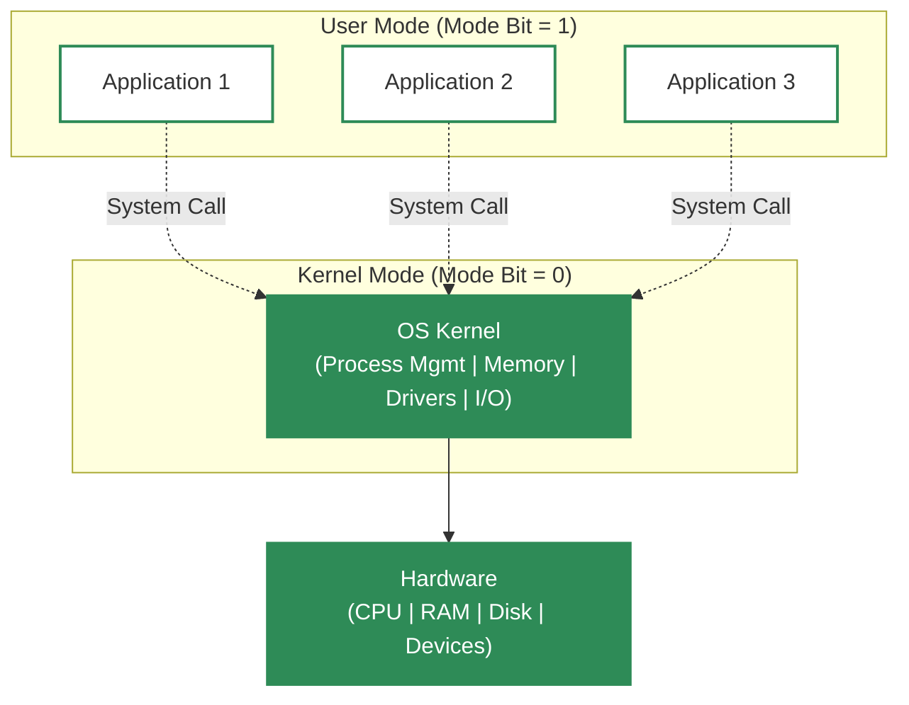
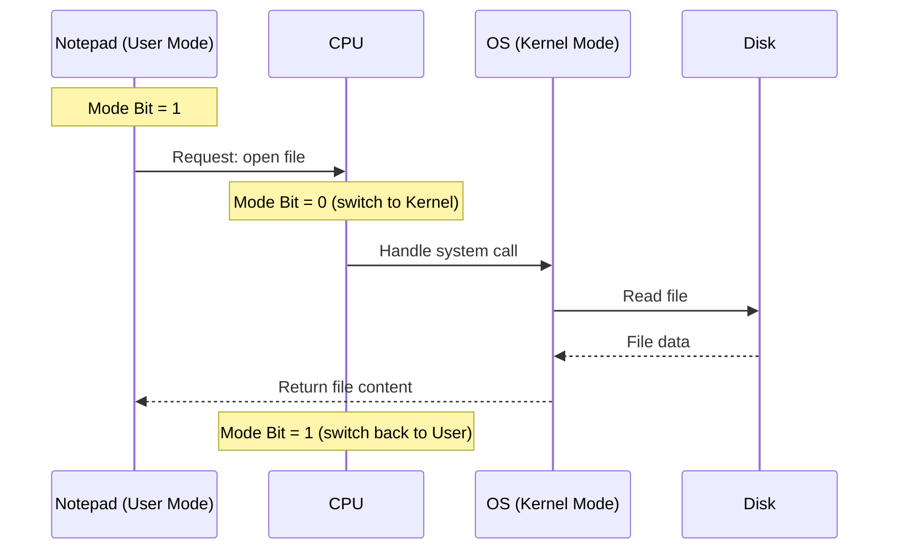
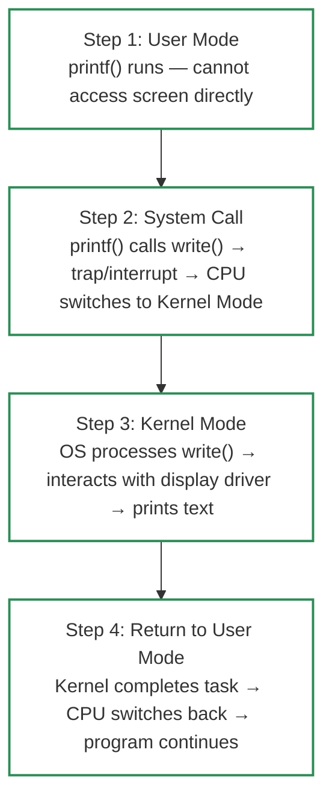

# User Mode and Kernel Mode in Operating System

A computer operates in **two distinct modes** to separate what ordinary programs can do from what the operating system can do. This separation is the foundation of system **security and stability**.

---

## 🖥️ The Two Modes at a Glance

| Mode | Who Runs Here | Access Level |
| :--- | :--- | :--- |
| **User Mode** | User applications, non-critical processes | Limited — cannot directly access hardware or critical resources |
| **Kernel Mode** | The OS kernel (core) | Full — unrestricted access to hardware, memory, I/O devices |

---

## 🍽️ Restaurant Analogy

| Real World | Computer World |
| :--- | :--- |
| **Customers** (in dining area) | User applications (in User Mode) |
| **Kitchen** (restricted area) | Kernel / Hardware |
| **Chefs** (in kitchen) | OS kernel (in Kernel Mode) |
| **Placing an order** | Making a system call |
| **Food delivered to table** | Result returned to the program |

- **User Mode**: Customers can only place orders — they **cannot enter the kitchen**. Apps can only make requests; they cannot touch hardware directly.
- **Kernel Mode**: Chefs have full access to ingredients (hardware) and can prepare food (handle system operations). The OS has full access to hardware and performs all privileged operations.
- A customer **cannot cook their own meal** (direct hardware access); they must **request the chef** (system call). Similarly, user programs cannot access hardware directly — they must request the OS via a system call.

---

## 🔢 The Mode Bit

The **Mode Bit** is a special flag (a single binary bit) in the CPU that indicates whether the system is currently running in User Mode or Kernel Mode.

| Mode Bit Value | Mode | Meaning |
| :--- | :--- | :--- |
| **1** | User Mode | Restricted access — applications run here |
| **0** | Kernel Mode | Full access — kernel runs here |

> **Current convention**: Kernel = 0, User = 1 (this is how most CPUs implement it)

### Why the Mode Bit Matters

The Mode Bit ensures **security and stability** by restricting direct access to critical system resources. The CPU checks this bit on every instruction — if a user-mode program tries to execute a privileged instruction (e.g., directly accessing memory-mapped I/O), the CPU generates a fault and the kernel handles it.

### Example: Opening a File in Notepad

1. **Notepad** (running in User Mode) requests the OS to open a file.
2. The CPU sets the **Mode Bit to 0** (Kernel Mode) so the OS can access the disk.
3. The OS reads the file and hands control back to Notepad.
4. The CPU sets the **Mode Bit back to 1** (User Mode), restoring restricted access.

---

## 🛡️ Kernel Mode (Privileged Mode)

**Kernel Mode** is the mode in which the core of the operating system (the kernel) runs.

### Characteristics

- **Unrestricted access** to all system resources: hardware, memory, I/O devices, etc.
- The kernel executes all **privileged operations**:
  - Memory management
  - Process scheduling
  - Hardware access
  - Interrupt handling
  - Device driver execution

### Why It's "Privileged"

Kernel Mode is highly privileged because it can access and modify system-critical resources. **Malfunctioning code in kernel mode** can lead to:

- System crashes (kernel panic / BSOD)
- Security vulnerabilities
- Data corruption

Therefore, **only trusted OS components** (kernel, device drivers, system services) run in kernel mode. User applications are never allowed to run in kernel mode.

---

## 👤 User Mode (Unprivileged Mode)

**User Mode** is the mode in which user applications and non-critical processes run.

### Characteristics

- **Restricted access** — cannot directly interact with hardware.
- The OS ensures user applications cannot access critical system resources.
- Acts as a **protective barrier** — even if a user application is compromised (e.g., by malware), it cannot take full control of the system.

### Why It's "Unprivileged"

User Mode limits what programs can do. A buggy or malicious app might crash itself, but it **cannot**:

- Corrupt other processes' memory
- Access another user's files without permission
- Bypass security checks
- Crash the entire system (unless it triggers a kernel bug)

---

## 🔄 Mode Transition (Mode Switch)

The transition between User Mode and Kernel Mode is called a **mode switch**. It happens in these situations:

| Trigger | What Happens |
| :--- | :--- |
| **System Calls** | A user program needs hardware access or a privileged operation. It makes a system call → OS switches to kernel mode to handle it → returns to user mode. |
| **Interrupts** | Hardware or software interrupts trigger the kernel to run an interrupt service routine in kernel mode. After handling, control returns to user mode. |
| **Exceptions** | A user program hits a critical error (e.g., divide by zero, invalid memory access). The CPU traps to kernel mode for error handling. |

> ⚠️ **Note**: The PDF calls this a "context switch," but technically a **context switch** means switching from one *process* to another (saving/restoring full process state). The transition between user and kernel modes is a **mode switch** — lighter weight, and it happens on every system call. Both terms may appear in exams; understand that a mode switch occurs when crossing the user/kernel boundary.

---

## 📝 Step-by-Step Example: Printing to the Screen

Imagine you want to print something using `printf()` in your program.

### Detailed Steps

| Step | Mode | What Happens |
| :--- | :--- | :--- |
| **1** | User Mode | Your program runs `printf()`. It cannot directly access the screen (hardware). |
| **2** | System Call | `printf()` internally calls the `write()` system call. This triggers a trap/interrupt, telling the CPU to switch to Kernel Mode. |
| **3** | Kernel Mode | The OS kernel processes the `write()` system call. It interacts with the display driver to print text on the screen. |
| **4** | Back to User Mode | The kernel completes the task and returns control. The CPU switches back to User Mode, and the program continues execution. |

---

## ⚖️ Kernel Mode vs User Mode — Summary Table

| Aspect | Kernel Mode | User Mode |
| :--- | :--- | :--- |
| **Mode Bit** | 0 | 1 |
| **Who runs** | OS kernel, drivers, system services | User applications |
| **Hardware access** | Full, direct | None — must use system calls |
| **Privilege level** | Highest (privileged) | Lowest (unprivileged) |
| **Risk if code fails** | Can crash entire system | Only that process crashes |
| **Memory access** | Can access all memory | Limited to own address space |

---

## 🔑 Key Takeaways

- The CPU operates in **two modes**: User Mode (restricted) and Kernel Mode (full access).
- The **Mode Bit** (1 = User, 0 = Kernel) enforces this separation at the hardware level.
- **User Mode** is a protective barrier — apps cannot directly harm the system or access hardware.
- **Kernel Mode** has complete control — only trusted OS code runs here.
- **Mode switches** occur on system calls, interrupts, and exceptions — not to be confused with context switches (process switches).
- This separation keeps the system **stable and secure** while allowing applications to run effectively.

---

### 📚 References
- *GeeksforGeeks* - [User Mode and Kernel Mode](https://www.geeksforgeeks.org/user-mode-and-kernel-mode/)
- *Gate Smashers* - [User Mode vs Kernel Mode](https://youtu.be/8duV1LLHHJU?si=UUayzapZ0MGE4BpM)
- *L15 - User mode and Kernel Mode in Operating System* (PDF)
