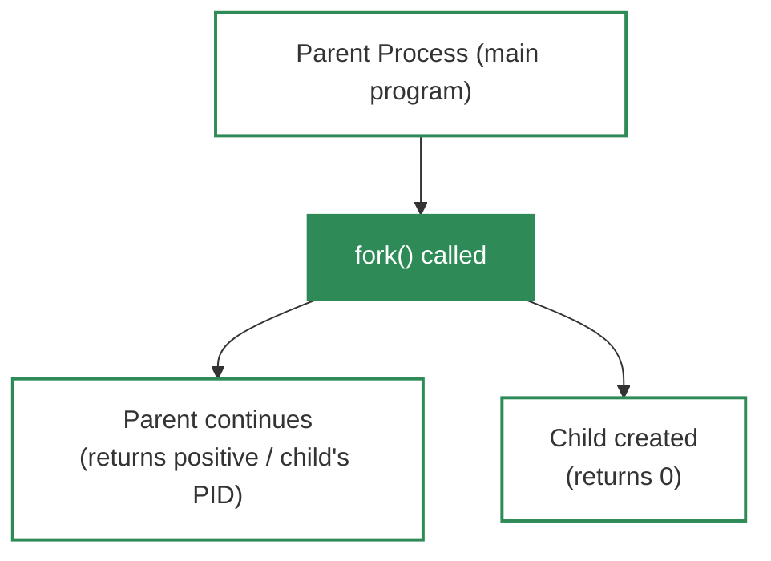
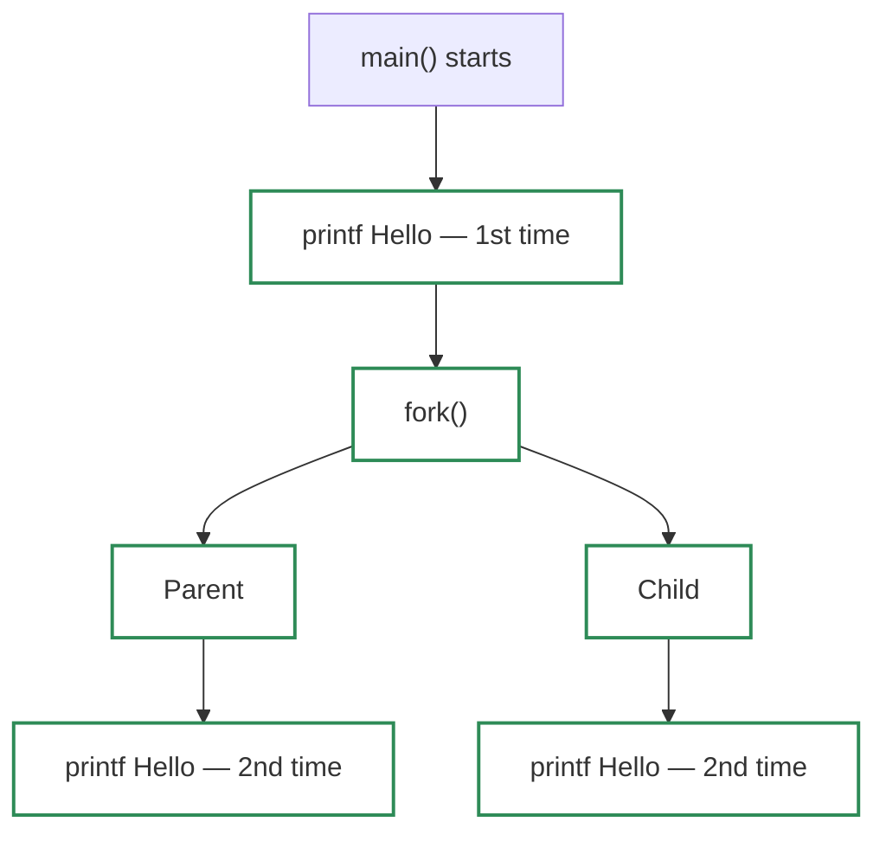
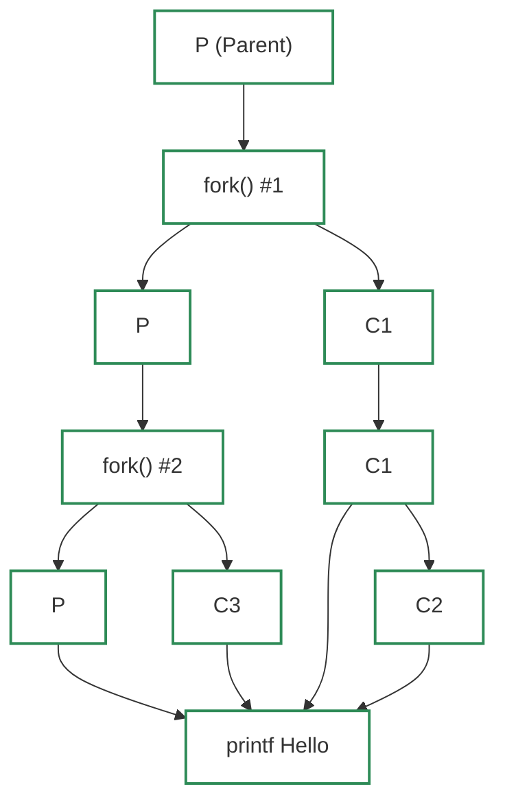
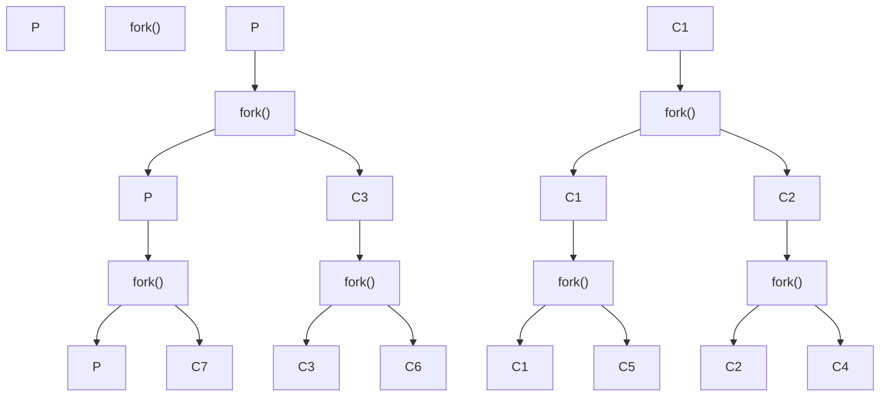

# Fork System Call

The **fork** system call is used to create a **child process** from an existing process (the parent). The child is an almost exact clone of the parent — it has its own Process ID (PID), its own registers, and its own memory space, but it starts by copying the parent's state at the moment `fork()` was called.

> **Fork** = "split" — one process becomes two. Both continue execution from the line after `fork()`.

---

## 🔑 What is fork()?

`fork()` is a **process control system call** (available on Unix, Linux, macOS) that:

- Creates a **child process** that is a clone of the calling process (the parent).
- Returns **different values** to the parent and the child so each can tell who it is.
- Allows the parent and child to run **concurrently** (in parallel).



---

## 📤 Return Values of fork()

`fork()` returns **three possible values** — but in most exam questions, we only care about two:

| Return Value | Meaning | Who Receives It |
| :--- | :--- | :--- |
| **0** | Child process | The newly created child |
| **Positive** (e.g., child's PID) | Parent process | The original process (parent) |
| **-1** | Error — child not created | Parent (e.g., kernel busy, resource limit) |

> In typical questions, we assume the child is created successfully, so we only use **0** (child) and **positive** (parent).

---

## 🧬 Fork vs Thread — Quick Comparison

| Aspect | Fork | Thread |
| :--- | :--- | :--- |
| **What is created** | A new process (full clone) | A lightweight unit within the same process |
| **Process ID** | Child has its own PID | Shares the same PID as the parent process |
| **Memory** | Separate address space (copy-on-write) | Shared address space |
| **Analogy** | Creating a full clone of yourself | Adding an extra "hand" — most things shared, one extra thing doing work |
| **Overhead** | Higher (new process, new PCB) | Lower (shared resources) |

---

## 📝 Basic Example — One fork()

```c
#include <stdio.h>
#include <unistd.h>

int main() {
    printf("Hello\n");   // Without fork: prints once
    fork();              // Child created here — both continue from next line
    printf("Hello\n");   // Prints TWICE (parent + child)
    return 0;
}
```

**Output:** `Hello` is printed **2 times**.

- **Without fork:** Only the parent runs → 1 print.
- **With fork:** Parent and child both run the code after `fork()` → 2 prints.



---

## 📝 Two fork() Calls

```c
int main() {
    fork();   // First fork: P creates C1
    fork();   // Second fork: P creates C3, C1 creates C2
    printf("Hello\n");
    return 0;
}
```

**What happens:**

1. **First fork:** Parent (P) creates child C1. Now we have **P** and **C1**.
2. **Second fork:** 
   - **P** creates another child → **C3**
   - **C1** (which also runs the second fork) creates its own child → **C2**

**Total processes:** P, C1, C2, C3 → **4 processes**  
**Output:** `Hello` is printed **4 times**.



---

## 📝 Three fork() Calls

```c
int main() {
    fork();
    fork();
    fork();
    printf("Hello\n");
    return 0;
}
```

**Process tree:**

| After | Processes |
| :--- | :--- |
| 1st fork | P, C1 |
| 2nd fork | P, C1, C2, C3 |
| 3rd fork | P, C1, C2, C3, C4, C5, C6, C7 |

**Total processes:** **8** (1 parent + 7 children)  
**Output:** `Hello` is printed **8 times**.



---

## 📐 Important Formulas (GATE / UGC NET)

These formulas are frequently asked in competitive exams:

| Question | Formula |
| :--- | :--- |
| **How many times does the code run?** (total executions) | **2<sup>n</sup>** |
| **How many child processes are created?** | **2<sup>n</sup> − 1** |

Where **n** = number of times `fork()` is called.

### Examples

| n (forks) | Total processes | Child processes | Total executions |
| :--- | :--- | :--- | :--- |
| 1 | 2 | 1 | 2 |
| 2 | 4 | 3 | 4 |
| 3 | 8 | 7 | 8 |
| 4 | 16 | 15 | 16 |

### Why 2<sup>n</sup>?

Each `fork()` doubles the number of processes. Every process that reaches the next `fork()` will create one more child.

| Forks | Processes |
| :--- | :--- |
| 0 | 1 |
| 1 | 2 = 2<sup>1</sup> |
| 2 | 4 = 2<sup>2</sup> |
| 3 | 8 = 2<sup>3</sup> |
| n | 2<sup>n</sup> |

---

## 🔢 Using Return Value to Distinguish Parent and Child

```c
#include <stdio.h>
#include <unistd.h>

int main() {
    pid_t pid = fork();

    if (pid == 0) {
        printf("I am the CHILD (PID: %d)\n", getpid());
    } else if (pid > 0) {
        printf("I am the PARENT (child's PID: %d)\n", pid);
    } else {
        printf("Child creation failed (error)\n");
    }

    return 0;
}
```

- **Child:** `pid == 0`
- **Parent:** `pid > 0` (the value is the child's PID)
- **Error:** `pid == -1` (rare in practice; usually assumed not to occur in exam questions)

---

## 🔑 Key Takeaways

- **fork()** creates a child process that is a clone of the parent.
- **Return value:** 0 = child, positive = parent (child's PID), -1 = error.
- **Total processes** after n forks = **2<sup>n</sup>**.
- **Total child processes** = **2<sup>n</sup> − 1** (parent is not a child).
- Parent and child run **concurrently** from the line after `fork()`.
- Fork is a **frequently asked topic** in GATE, UGC NET, and other CS competitive exams.

---

### 📚 References
- *Gate Smashers* - [Fork System Call](https://youtu.be/ixq5cpdEO2Q?si=2GKnLP7s9uiFaBU4)
- *GeeksforGeeks* - [fork() in C](https://www.geeksforgeeks.org/fork-system-call/)
- *man fork(2)* - Linux/Unix manual
