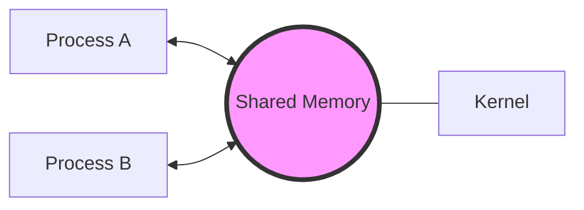

# Inter Process Communication (IPC)

*Last Updated : 24 Apr, 2026*

Inter-Process Communication or **IPC** is a mechanism that allows processes to communicate and share data with each other while they are running. Since each process has its own private memory space, IPC provides controlled methods for exchanging information and coordinating actions. It helps processes work together efficiently and safely in an operating system.

It helps processes synchronize their activities, share information and avoid conflicts while accessing shared resources.

---

## 🛠️ Methods of IPC

There are two primary methods of IPC: **Shared Memory** and **Message Passing**. An operating system can implement both methods of communication.

> 💡 **Example**: A simple example of IPC is a **bank ATM system**, where one process reads the card and PIN, another checks the account balance, and a third dispenses cash. These processes communicate and coordinate to complete the transaction correctly.

### 1. Shared Memory
Communication between processes using shared memory requires processes to share a memory segment, the implementation of which is handled by the programmer. 

- **Mechanism**: A common memory space is allocated by the kernel.
- **Process A**: Writes data into the shared memory region.
- **Process B**: Directly reads this data from the same shared memory region.
- **Pros**: Very fast because it occurs at memory speeds.
- **Cons**: Requires synchronization mechanisms (like semaphores) to avoid conflicts when multiple processes read/write simultaneously.

> 📝 **Example**: Multiple people editing the same document at the same time in **Google Docs**.

### 2. Message Passing
Message Passing is a method where processes communicate by sending and receiving messages to exchange data. One process sends a message and the other process receives it, allowing them to share information.

- **Mechanism**: Processes exchange information by sending and receiving messages through the **kernel**.
- **Process A**: Sends a message to the kernel.
- **Kernel**: Delivers the message to Process B.
- **Methods**: Sockets, Message Queues, or Pipes.
- **Pros**: Simpler and safer because there’s no risk of overwriting shared data.
- **Cons**: Incurs more overhead due to kernel involvement (system calls).

> 📝 **Example**: Multiple people sending updates to a **group chat**, where each message goes through the server before others see it.

---

## ⚠️ Problems in IPC
Inter-Process Communication faces several challenges when multiple processes share resources:
- **Race Conditions**: When multiple processes access and manipulate the same data concurrently.
- **Deadlock**: When processes are blocked because each is waiting for a resource held by another.
- **Starvation**: When a process is perpetually denied necessary resources.
- **Data Inconsistency**: Shared data may become corrupt if not handled properly.
- **Security & Scalability**: Managing many processes can lead to overhead and security risks.

---

## 🏛️ Classical IPC Problems

These are standard problems used to test synchronization mechanisms:

### 1. Dining Philosophers Problem
Illustrates **deadlock and starvation**. Five philosophers sit around a table, each needing two forks to eat. If everyone picks up one fork simultaneously, no one can eat.
- **Solution**: Use semaphores/monitors, limit the number of philosophers eating, or enforce an order of picking forks.

### 2. Producer–Consumer Problem
Deals with **synchronization and buffer management**. Producers place data in a buffer; consumers remove it.
- **Challenge**: Prevent producers from adding to a full buffer and consumers from removing from an empty one.
- **Solution**: Use mutex for mutual exclusion and counting semaphores to track buffer slots.

### 3. Readers–Writers Problem
Focuses on **concurrent access**. Multiple readers can read simultaneously, but writers need exclusive access.
- **Challenge**: Avoiding starvation of either readers or writers.
- **Solution**: Use reader-writer locks or semaphores with priority rules.

### 4. Sleeping Barber Problem
Demonstrates **process coordination**. A barber sleeps when there are no customers and is awakened when a customer arrives.
- **Challenge**: Managing waiting chairs and arrival timing correctly.
- **Solution**: Use semaphores to manage customer arrival and barber availability.

---

## 🎯 Interview Preparation: Q&A

### 💡 Top Interview Questions

1. **What is the main difference between Shared Memory and Message Passing?**
   - **Shared Memory**: Processes share a region of memory. It's faster but requires the programmer to handle synchronization (e.g., semaphores).
   - **Message Passing**: Processes communicate via messages through the kernel. It's safer and easier to implement but slower due to system call overhead.

2. **Why do we need synchronization in Shared Memory?**
   - Without synchronization, multiple processes might try to write to the same memory location at the same time, leading to **Race Conditions** and data corruption.

3. **What is a Race Condition?**
   - A race condition occurs when the final outcome of a process depends on the specific order or timing of other uncontrollable events (like which process reaches a variable first).

4. **Explain the Dining Philosophers problem in one sentence.**
   - It's a classic synchronization problem that demonstrates how a set of processes can get stuck in a **deadlock** when competing for a limited set of shared resources.

5. **How does the Producer-Consumer problem handle a full buffer?**
   - The producer must go into a "waiting" or "sleep" state until the consumer removes at least one item from the buffer, signaling that there is space available.

6. **In the Readers-Writers problem, why can multiple readers access the resource at once?**
   - Reading data does not modify it. Since the data remains unchanged, multiple processes can safely read it simultaneously without causing inconsistency. Only writing requires exclusive access.

7. **What is the role of the Kernel in Message Passing?**
   - The kernel acts as a mailbox or intermediary. It manages the message queues and ensures that messages are delivered to the correct recipient process safely.
