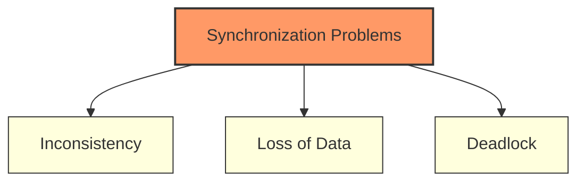

# Introduction to Process Synchronization

*Last Updated : 24 Apr, 2026*

Process Synchronization is a fundamental mechanism in operating systems designed to manage the execution of multiple processes that access shared resources. Its primary goal is to ensure **data consistency**, prevent **race conditions**, and avoid **deadlocks** in multi-process environments.

---

## 🔄 Categorization of Processes

On the basis of synchronization requirements, processes are categorized into two types:

| Type | Description |
| :--- | :--- |
| **Independent Process** | The execution of one process does not affect the execution of other processes. |
| **Cooperative Process** | A process that can affect or be affected by other processes executing in the system. These require careful coordination. |

:::info Pro Tip
Process Synchronization is essentially the coordination of multiple cooperating processes to ensure controlled access to shared resources, preventing conflicts.
:::

---

## ⚠️ Problems with Improper Synchronization

Lack of proper synchronization in an Inter-Process Communication (IPC) environment leads to several critical issues:

1. **Inconsistency**: When two or more processes access shared data simultaneously. One process's update might be overwritten by another, making data unreliable.
2. **Loss of Data**: Occurs when multiple processes try to write to the same resource without coordination. Important information can be lost or corrupted.
3. **Deadlock**: Two or more processes get stuck waiting for each other to release resources. The system becomes unresponsive.

---

## 🛡️ Role of Synchronization in IPC

Synchronization acts as the "traffic controller" for processes, ensuring:

- **Preventing Race Conditions**: Avoiding simultaneous access to shared data.
- **Mutual Exclusion**: Allowing only one process in the critical section at a time.
- **Process Coordination**: Managing dependencies (e.g., producer-consumer).
- **Deadlock Prevention**: Avoiding circular waits and indefinite blocking.
- **Safe Communication**: Ensuring messages are processed in the correct order.
- **Fairness**: Preventing starvation by giving all processes fair access.

---

## 🧪 Types of Process Synchronization

There are two primary types of synchronization in an OS:

### 1. Competitive Synchronization
Processes compete for a shared resource.
- **Risk**: Lack of synchronization leads to **Inconsistency** or **Data Loss**.

### 2. Cooperative Synchronization
Processes are affected by each other (one's execution affects the other).
- **Risk**: Lack of synchronization leads to **Deadlock**.

> 💡 **Example**: Consider the Linux command pipeline: `ps | grep "chrome" | wc`. 
> Here, `ps` produces data, `grep` consumes it and produces more, and `wc` consumes the final result. These are **cooperative processes** working together.

---

## 🔑 Required Conditions for Synchronization

To solve the synchronization problem, three concepts must be understood and managed:

### 1. Critical Section
A code segment that accesses shared variables or resources. Only **one process** can be in its critical section at a time. The "Critical Section Problem" involves designing a protocol for processes to access these resources safely.

### 2. Race Condition
A situation that occurs when the final outcome of the execution depends on the specific order in which processes/threads execute inside the critical section.

### 3. Pre-emption
When the OS stops a running process to give CPU time to another. This is critical because issues arise if a process is preempted while it has not finished its job on a shared resource, leaving it in an inconsistent state.

:::danger[Crucial Note]
Synchronization mechanisms must ensure that shared data remains consistent even if processes are preempted at arbitrary points in their execution.
:::
