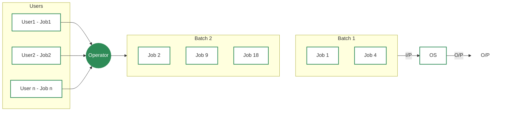
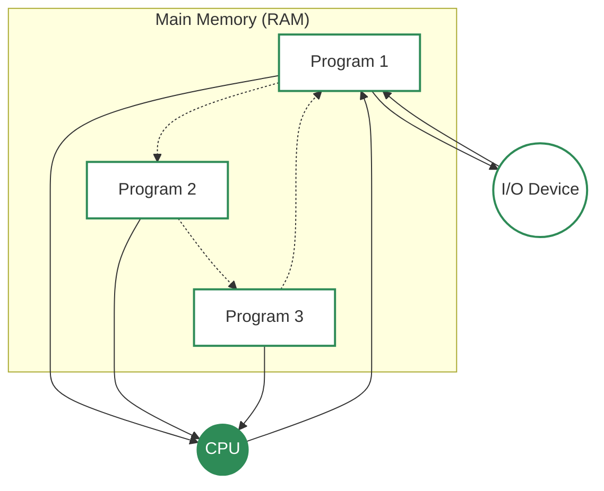

# Types of Operating System
- An operating system (OS) is software that manages computer hardware and software resources. It acts as a bridge between users and the computer, ensuring smooth operation. Different types of OS serve different needs; some handle one task at a time, while others manage multiple users or real-time processes.

### 📋 List of Operating Systems
1.  **Batch Operating System**
2.  **Multi-Programming Operating System**
3.  **Multi-Tasking / Time-Sharing Operating System**
4.  **Multi-Processing Operating System**
5.  **Distributed Operating System**
6.  **Network Operating System**
7.  **Real-Time Operating System**
8.  **Mobile Operating System**
---
## 1. Batch Operating System

**Definition**: A Batch Operating System is a type of operating system that executes groups of jobs (called batches) automatically, without direct user interaction during execution. Instead of running one program at a time with user input, similar tasks are collected, grouped, and processed together.

### 🟢 What is a Batch OS?
The batch-processing operating system was very popular in the 1970s. In batch operating system the jobs were performed in batches. This means Jobs having similar requirements are grouped and executed as a group to speed up processing. Users using batch operating systems do not interact with the computer directly. Each user prepares their job using an offline device for example a punch card and submits it to the computer operator. Once the programmers have left their programs with the operator, they sort the programs with similar needs into batches.

### ⚙️ How it Works
1.  **Job Submission**: Users prepare their jobs and hand them to an operator.
2.  **Batching**: The operator groups jobs with similar requirements into a **"Batch"**.
3.  **Execution**: The computer processes the whole batch sequentially (one after another) without stopping.

### ✨ Key Features
*   **No Interaction**: Users cannot control the program while it is running.
*   **Offline Processing**: Jobs are prepared away from the main computer.
*   **Efficiency**: Grouping similar jobs speeds up processing by reducing setup time.
*   **Ideal for**: Large volumes of data where no user input is needed (e.g., generating monthly bills).

### 🏛️ Examples
*   **Payroll Systems** (calculating salaries for thousands of employees).
*   **Bank Statements**.
*   **IBM's z/OS**.

### ✅ Advantages of Batch OS
*   **Resource Efficiency**: Keeps the CPU busy by reducing idle time between jobs.
*   **High Speed**: Can process large numbers of jobs quickly (High Throughput).
*   **Less User Error**: Since the computer handles execution, there are fewer chances of manual mistakes.
*   **Cost Effective**: Ideal for organizations performing repetitive, bulk tasks (like billing).

### ❌ Disadvantages of Batch OS
*   **No Direct Interaction**: Users cannot provide input or correct errors once the job starts.
*   **Hard to Debug**: If a job fails, it can be difficult to find the error immediately.
*   **Long Wait Time**: Users must wait for the entire batch to process before seeing results.
*   **Starvation**: If a job enters an infinite loop, other jobs in the batch must wait.

### 📝 Conclusion
Batch Operating Systems are great for **bulk, repetitive tasks** where speed matters and user interaction isn't needed, but they lack the flexibility and responsiveness of modern systems.

---

## 2. Multi-Programming Operating System

**Definition**: Multi-Programming is a technique where the operating system keeps multiple programs (or processes) in memory at the same time. When one program has to wait (e.g., for input/output), the CPU switches to another program, ensuring the CPU is always busy.

### 🟢 What is a Multi-Programming OS?
As the name suggests, Multiprogramming means more than one program can be active at the same time. Before the operating system concept, only one program was to be loaded at a time and run. These systems were not efficient as the CPU was not used efficiently.

Example: In a single-tasking system, the CPU is not used if the current program waits for some input/output to finish. The idea of multiprogramming is to assign CPUs to other processes while the current process might not be finished. This has the below advantages:
   - The user gets the feeling that he/she can run multiple applications on a single CPU even if the CPU is running one process at a time.
   - CPU is utilized better.

### ⚙️ How it Works
1.  **Load Multiple Programs**: The OS loads several programs into the main memory (RAM).
2.  **CPU Scheduling**: The CPU executes instructions from one program.
3.  **Switching**: If the current program needs to wait (e.g., for data from a hard drive), the OS **switches** the CPU to another program that is ready to run.
4.  **Return**: Once the waiting task is done, it can be brought back into memory.

### ✨ Key Features
*   **High CPU Utilization**: The CPU rarely stays idle.
*   **Better Throughput**: More jobs are completed in the same amount of time compared to batch systems.
*   **Memory Management**: Requires sophisticated memory management to keep track of multiple programs.
*   **No Interaction**: Like batch systems, users generally do not interact with the programs while they are running.

### 🏛️ Examples
*   **Early mainframe systems** (like IBM System/360).
*   **Modern batch processing systems** that require some level of multitasking.

---

### Multi-Programming Diagram

### ✅ Advantages of Multi-Programming
*   **Better CPU Utilization**:  CPU stays busy by switching to another job during I/O wait.
*   **Better Response**: Users get faster turnaround times as their jobs are processed sooner.
*   **Resource Sharing**: Memory and I/O devices are shared among multiple programs.
*   **Higher Throughput**: More jobs can be completed in a given time.

### ❌ Disadvantages of Multi-Programming
*   **Complex Memory Management**: Requires sophisticated techniques to manage memory for multiple programs.
*   **Deadlock Risk**: Programs might wait for each other indefinitely (deadlock).
*   **Security Issues**: One program might accidentally access or corrupt another program's data.
*   **No Direct Interaction**: Users still cannot interact with their programs during execution.
*   **High Memory Requirement**: Needs larger RAM to run multiple programs together..

### 📝 Conclusion
Multi-Programming was a significant improvement over batch systems, allowing for **better resource utilization** and **faster processing**. It laid the groundwork for modern multitasking operating systems.

---
