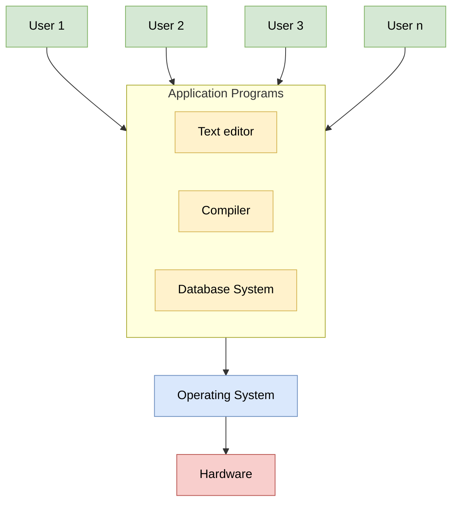

# 🖥️ Operating System 

:::info What actually is an OS?
Think of the **Operating System (OS)** as the **Government** of your computer. It manages resources, enforces rules, and ensures that different programs (citizens) can function without chaos. Without it, your powerful hardware is just a pile of metal!
:::

- **The Boss:** Manages computer resources such as CPU, memory, and files.
- **The Translator:** Acts as a bridge between you (the user) and the complex hardware.
- **The Traffic Cop:** Decides which program gets to use the CPU.Performs core functions like process, memory, and file management
- **Examples:** 🐧 Linux, 🍎 macOS, 🪟 Windows, 🤖 Android.

---

## 🧱 Basics
> *Start here! Understanding the foundation.*
Before diving into complex algorithms, we need to understand what makes an OS tick. What is a Kernel? How does your computer actually start up?

- [Introduction](./basic-intro/01_introduction.md)
- [Types of OS](./basic-intro/02_types_of_os.md)
- [Kernel in OS](./basic-intro/03_kernel_in_os.md)
- [System Call](./basic-intro/04_system_call.md)
- [System Initialization](./basic-intro/05_system_initialization.md)

---

## ⏱️ Process Scheduling
> *"Who goes next?"*
Imagine a single CPU core having to run a music player, a browser, and a game all at once. How does it decide who gets the CPU time? **Process Scheduling** is the art of multitasking.

- [Process Introduction](./basic-intro/02_types_of_os.md)
- Process Control Block
- Process Table
- Process Management Introduction
- Process States
- Process Scheduler
- CPU Scheduling Algorithms
- Preemptive vs Non-Preemptive
- Dispatcher vs scheduler
- Starvation and Aging

---

## 🚦 Process Synchronization
> *" avoiding Chaos"*
When multiple processes try to edit the same data at the same time, disasters happen (like two people trying to withdraw money from the same account simultaneously!). **Synchronization** ensures data consistency.

- Inter Process Communication
- Process Synchronization
- Race Condition
- Critical Section
- Solutions to Process Synchronization Problems
- Peterson’s Algorithm
- Dekker’s algorithm
- Bakery Algorithm
- Hardware Based Solutions
- Semaphores
- Mutex vs. Semaphore
- Monitors
- Priority Inversion
- Classical IPC Problems 

---

## 🛑 Deadlock
> *"The Ultimate Traffic Jam"*
Imagine four cars at a 4-way stop, and everyone is waiting for the other to move. No one moves. That's a **Deadlock**. We learn how to prevent, avoid, and detect these situations.

- Introduction
- Deadlock Handling
- Deadlock Prevention
- Banker’s Algorithm for Deadlock Avoidance
- Detection And Recovery
- Starvation, and Livelock
- Resource Allocation Graph (RAG)
- Methods of resource allocation
- Program for Deadlock free condition

---

## 🧵 Multithreading
> *"Doing more with less"*
Why launch a whole new heavy process when you can just spawn a lightweight thread? Learn how modern applications achieve high performance using threads.

- Operating System | Thread
- User Level Vs Kernel Level threads
- Process-based and Thread-based Multitasking
- Multi threading models
- Benefits of Multithreading

---

## 💾 Memory Management
> *"Playing Tetris with RAM"*
Your RAM is limited. The OS has to cleverly fit different programs into memory, move them around, and even pretend to have more memory than physically exists (**Virtual Memory**)!

### 1. Basics
- Introduction to memory and memory units
- Memory Management in Operating System
- Logical and Physical Address in Operating System

### 2. Contiguous Allocation
- Implementation of Contiguous Memory Management
- Internal Fragmentation
- External Fragmentation
- Program for Next Fit algorithm in Memory Management
- Buddy System: Memory allocation technique

### 3. Non-Contiguous Allocation
- Non-Contiguous Allocation in Operating System
- Paging
- Page Table Entries in Page Table
- Segmentation
- Segmentation with Paging

### 4. Advanced Memory Concepts
- Overlays in Memory Management
- Virtual Memory
- Demand Paging
- Page Fault Handling
- Swap Space

### 5. Page Replacement & Thrashing
- Page Replacement Algorithms
- Belady’s Anomaly
- Second Chance (or Clock) Page Replacement Policy
- Techniques to handle Thrashing
- Working Set in Paging

### 6. Kernel & System-Level Concepts
- Allocating kernel memory (buddy system and slab system)
- Memory Interleaving
- Operating system based Virtualization

---

## 💿 Disk Management
> *"Organizing the Library"*
How does the OS store files on your hard drive so you can find them instantly years later? From File Systems to moving the disk arm efficiently (**Disk Scheduling**).

- File Systems
- Unix File System
- File Directory | Path Name
- Structures of Directory
- File Allocation Methods
- File Access Methods
- Secondary memory
- Secondary memory – Hard disk drive
- Disk Scheduling Algorithms
- Program for SSTF disk scheduling algorithm
- What exactly Spooling is all about?
- Spooling vs Buffering
- Free space management
